<div align="center">
    <h1>🚀tkintertools🚀</h1>
    <p>
    </p>
    <p>The <code>tkintertools</code> module is an auxiliary module of the <code>tkinter</code> module</p>
    <p><code>tkintertools</code> 模块是 <code>tkinter</code> 模块的辅助模块</p>
    <p>
        <a href="./tkintertools/__init__.py">
            
        </a>
        <a href="./LICENSE">
            
        </a>
        <a href="./CHANGELOG.md">
            
        </a>
        <a href="./TODO.md">
            
        </a>
        <a href="https://pypistats.org/packages/tkintertools">
            
        </a>
    </p>
    <p>
        <a href="mailto:2951256653@qq.com">
            
        </a>
        <a href="https://xiaokang2022.blog.csdn.net">
            
        </a>
        <a href="https://github.com/Xiaokang2022">
            
        </a>
    </p>
</div>

Installation/模块安装
-----------------------

### Stable version/稳定版本

* Version/版本 : 2.6.2
* Release Date/发布日期 : 2023/05/30

```
pip install tkintertools==2.6.2
```
或者
```
pip install tkintertools
```

这个是目前的最新稳定版，比较稳定，bug 没有那么多，推荐使用这个。  
稳定版有文档可以查看，有 issue 我会去查看并尝试解决 issue。

### Development version/开发版本

* Version/版本 : 2.6.3
* Release Date/发布日期 : 2023/06/06

```
pip install tkintertools-dev==2.6.3
```

这个是我正在开发的版本，有新功能，但不能保证稳定，bug 可能会比较多。  
开发版本没有对应的文档，大家可以在 issue 中提出建议，我会适当采纳一些并在开发版本中更改或实现。

News/最新功能
------------

最新版的`tkintertools`为`2.6.2`，新增一项极为强大的功能：3d绘图！  
同时修复一些bug，优化了一部分代码，提升了一部分性能。

通过以下代码来使用3d绘图功能：

```python
from tkintertools import tools_3d as t3d
import tkintertools.tools_3d as t3d
# 两种引入方式都可以
```

子模块: [tools_3d.py](./tkintertools/tools_3d.py)

目前3d绘图功能还比较简陋，仅能绘制点、线、面以及直边的空间几何体，对于曲边的空间几何体还在开发中！  
以下是一个使用3d绘图的示例：

在这个示例中，按住鼠标左键可以旋转几何体，按住鼠标右键可以平移几何体，滚动鼠标滚轮可以缩放几何体！  
x、y 和 z 轴分别是红色、绿色和蓝色的线。

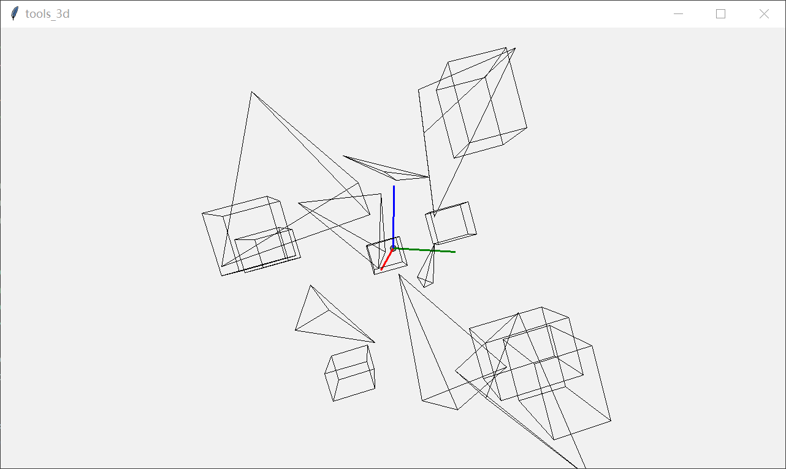

<details><summary><b>源代码</b></summary>

```python
import random
import tkinter

import tkintertools as tkt
from tkintertools import tools_3d as t3d

root = tkt.Tk('tools_3d', 1280, 720)
canvas = t3d.Canvas_3D(root, 1280, 720, 0, 0)

geos = []  # type: list[t3d.Geometry]
origin = t3d.Point(canvas, [0, 0, 0], size=5)  # 原点
axes = [t3d.Line(canvas, [0, 0, 0], [100, 0, 0], width=3, fill='red'),  # 创建坐标轴
        t3d.Line(canvas, [0, 0, 0], [0, 100, 0], width=3, fill='green'),
        t3d.Line(canvas, [0, 0, 0], [0, 0, -100], width=3, fill='blue')]

for _ in range(8):
    # 创建正方体
    cube = t3d.Cuboid(
        canvas, *random.sample(range(-200, 200), 3), *random.sample(range(50, 100), 3))
    geos.append(cube)
    # 创建四面体
    x, y, z = random.sample(range(-200, 200), 3)
    tetr = t3d.Tetrahedron(
        canvas, *[[x+random.randint(-100, 100), y+random.randint(-100, 100), z+random.randint(-100, 100)] for _ in range(4)])
    geos.append(tetr)


def translate(event, flag=False, _cache=[]):
    # type: (tkinter.Event, bool, list[float]) -> None
    """ 平移事件 """
    if flag:
        _cache[:] = [event.x, event.y]
        return
    dx = (event.x - _cache[0]) / 6
    dy = (event.y - _cache[1]) / 6
    _cache[:] = [event.x, event.y]
    for axis in axes:
        axis.translate(0, 6*dx, 6*dy)
        axis.update()
    for geo in geos:
        geo.translate(0, dx, dy)
        geo.update()
    origin.translate(0, 6*dx, 6*dy)
    origin.update()


def rotate(event, flag=False, _cache=[]):  # type: (tkinter.Event, bool, list[float]) -> None
    """ 旋转事件 """
    if flag:
        _cache[:] = [event.x, event.y]
        return
    dy = (event.x - _cache[0]) / 200
    dx = (_cache[1] - event.y) / 200
    _cache[:] = [event.x, event.y]
    for axis in axes:
        axis.rotate(0, 6*dx, 6*dy, center=origin.coords)
        axis.update()
    for geo in geos:
        geo.rotate(0, dx, dy, center=origin.coords)
        geo.update()


def scale(event):  # type: (tkinter.Event) -> None
    """ 缩放事件 """
    k = 1.01 if event.delta > 0 else 0.99
    for geo in geos:
        geo.scale(k, k, k)
        geo.update()


root.bind('<Button-1>', lambda event: rotate(event, True))
root.bind('<B1-Motion>', rotate)
root.bind('<Button-3>', lambda event: translate(event, True))
root.bind('<B3-Motion>', translate)
root.bind('<MouseWheel>', scale)
root.mainloop()
```

</details>

更多更新信息请见：[CHANGELOG.md](./CHANGELOG.md)

Description/模块说明
----------------------

tkintertools 是一款基于 tkinter 模块的二次开发的界面编程模块，它完全没有使用任何第三方模块和库的，同时，它也没有任何依赖包，它的功能完全由内置模块和函数实现，而且，它还是跨平台的！它和 tkinter 最大的不同在于，它的控件并非真实的控件，而是在 tkinter 模块中 Canvas 对象中绘制而成的，这就赋予了 tkintertools 控件一些在 tkinter 中没有的特性，列举如下：

* 控件背景可以是透明的（实际上是没有背景颜色）
* 控件的样式可以是自定义的（比如按钮有圆角）
* 控件的创建速度远大于 tkinter 的控件（除了 Canvas 控件）

但同时也产生了一些缺点：

* 虚拟的控件无法获取焦点
* 虚拟的控件在文本输入和显示的功能上存在一些缺陷（这个缺陷不是很明显，但强迫症就有点难受了，比如我）

tkintertools 模块还具有一些特色的功能：

* 利用 tkinter 和 tkintertools 创建的程序，在高分辨率的情况下，tkintertools 的会更加清晰（这点对于笔记本用户很友好，比如我）
* 可以迅速实现渐变色的效果
* 窗口缩放，所有的控件的大小跟着缩放（当然，也可以设置为不跟随缩放）

注意：需要 **Python3.7** 及更高版本才能运行 tkintertools！

Provides/模块功能
-------------------

Here, only the more distinctive features will be listed  
这里只会列举出比较具有特色的功能

### Customizable widgets/可自定义的控件

tkintertools 模块的控件拥有许多参数供我们设置，比如圆角的半径、文本和边框以及控件内部的颜色，关联事件等等。  
这里要说明的是，每个控件可以设置的关联事件不止一种，在鼠标经过控件时可以绑定事件，鼠标点击控件也可以，鼠标点击后松开也行等等。  
文本和边框以及控件的填充色也是类似的，在鼠标经过控件、点击控件、点击后松开都可以设定颜色。  
文本类控件还能够从右边逐步输入文本，文本输入提示符也可以不是单调无趣的竖线，可以是其他的，比如下划线等。  
最后，大家可以看一下 [test.py](./test.py) 文件里面的示例，这个示例展示了 tkintertools 模块的绝大部分功能，示例中更有隐藏的 “多彩变幻” 彩蛋哦！

### Automatically control size/自动控制大小

tkintertools 中的控件，其大小和形状可以随着窗口的变化而成比例地变化，不仅仅是控件中的文本，Canvas 绘制的图形也会随之变动，更让人兴奋的是，png 类型的图片也会随之成比例地缩放！当然，你也可以设定参数让其不随之变动，也可以设定参数使其在缩放的时候保持横纵方向的比例。  
总之，很方便，很舒适！

### Easily move widgets/轻松移动控件

见 [移动函数](#move)

### Gradient colors/渐变色

见 [颜色函数](#Gradient)

### Automatically adapt to DPI/自动适应DPI

见 [DPI 级别设置函数](#DPI)

### Detailed type hints/详细的类型提示

参考 [PEP 526](https://peps.python.org/pep-0526/)、[PEP 586](https://peps.python.org/pep-0586/)、[PEP 604](https://peps.python.org/pep-0604/) 和 [PEP 612](https://peps.python.org/pep-0612/)，我采用了最兼容的方式去实现详细的类型提示，可适用 IDE 有 VScode、Pycharm 等。  
那什么是类型提示呢？话不多说，直接看图就行：


在 VSCode 编辑器中，当鼠标移至类或者函数的名字上面时，会自动显示该类或者函数的注释文档。通过这种方式，不需要看太多的帮助文档和资料就能熟练地使用 tkintertools 模块！

### Across Platforms/跨平台

[test.py](./test.py) 在 Windows 系统（Windows10）上运行的界面如下：

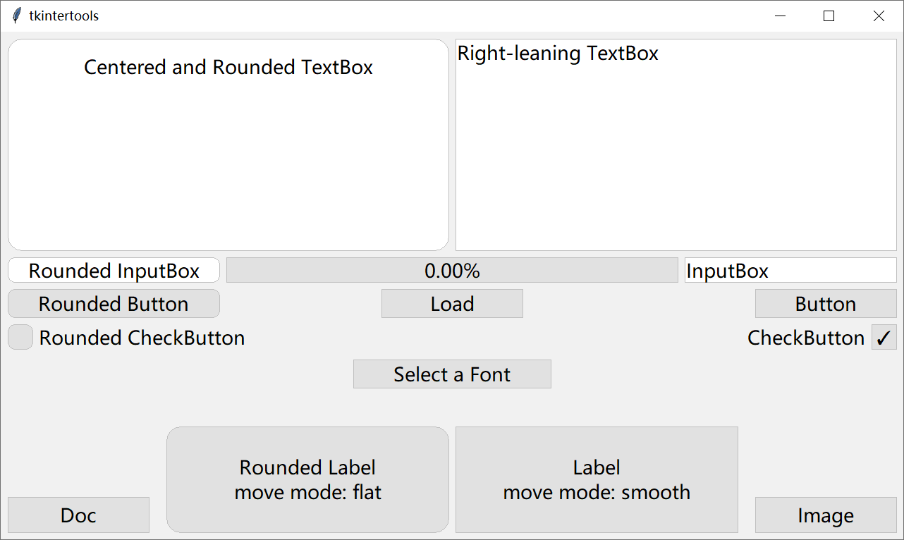

[test.py](./test.py) 在 Linux 系统（Ubuntu22.04）上运行的界面如下：

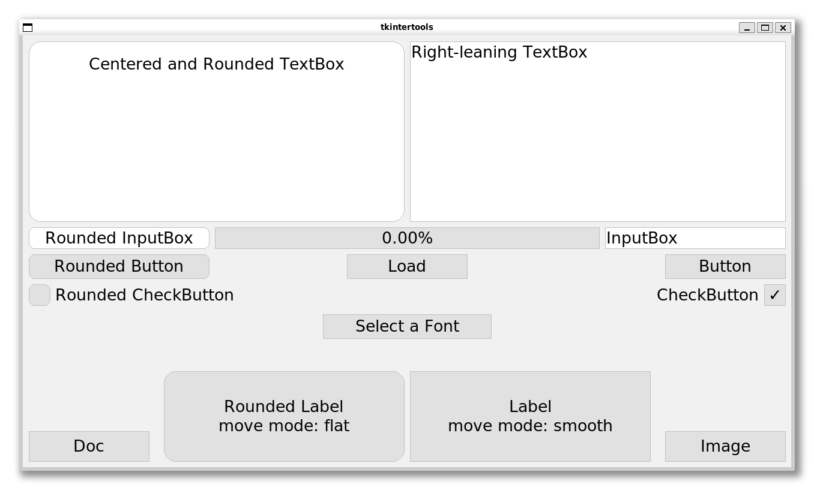

Contents/模块内容
-------------------

Each non internal class and function in the module will be described in detail here  
这里会详细说明模块中的每个非内部类和函数

### Container Widget/容器控件

1. `Tk`: 窗口类

    继承于`tkinter.Tk`，在继承了`tkinter`模块内`Tk`的基础上，又加入了对`tkintertools`模块中的`Canvas`对象的支持，并加入了检测窗口大小是否缩放的机制，以使得其子`Canvas`均能正确地进行缩放

2. `Toplevel`: 顶级窗口类

    继承于`tkinter.Toplevel`和`Tk`，加入了对`tkintertools`模块中的`Canvas`对象的支持，其余均与`Tk`一样

3. `Canvas`: 画布类

    继承于`tkinter.Canvas`，加入了对画布虚拟控件的支持，同时是各类响应事件、缩放控制的管理者，也对`tkinter.Canvas`的实例方法有一定的兼容性

### Virtual Canvas Widget/虚拟画布控件

1. `Label`: 标签控件

    标签控件的功能和`tkinter.Label`的功能类似，但更加的多元化  
    下面是`Label`控件的外观：  

    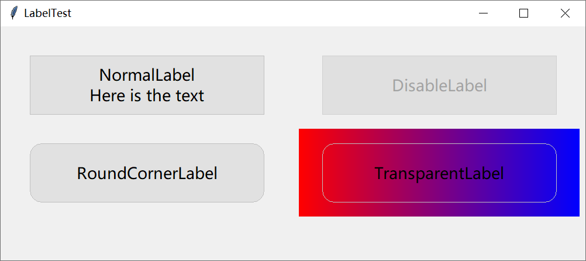

    <details><summary><b>源代码</b></summary>

    ```python
    import tkintertools as tkt

    root = tkt.Tk('LabelTest', 1000, 400)
    canvas = tkt.Canvas(root, 1000, 400, 0, 0)


    def colorful(x, y, width, height):  # type: (int, int, int, int) -> None
        """ Gradient colors """
        for i in range(width):
            color = tkt.color(('#FF0000', '#0000FF'), i/width)
            canvas.create_line(x+i, y, x+i, y+height, fill=color)


    colorful(510, 175, 480, 150)
    tkt.Label(canvas, 50, 50, 400, 100, text='NormalLabel\nHere is the text')
    tkt.Label(canvas, 50, 200, 400, 100, radius=20, text='RoundCornerLabel')
    tkt.Label(canvas, 550, 50, 400, 100, text='DisableLabel').set_live(False)
    tkt.Label(canvas, 550, 200, 400, 100, radius=20,
            text='TransparentLabel', color_fill=tkt.COLOR_NONE)

    root.mainloop()
    ```

    </details>

2. `Button`: 按钮控件

    按钮控件相较于`tkinter.Button`，其自由度更高，`tkinter.Button`只有在按下的时候才能触发绑定的关联事件，而`Button`却可以在鼠标移至按钮上方时、鼠标按下时、鼠标松开时都可以绑定关联事件  
    下面是`Button`控件的外观：

    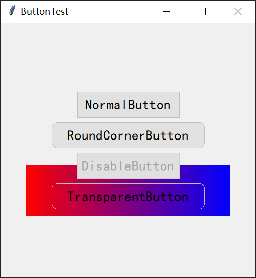

    <details><summary><b>源代码</b></summary>

    ```python
    import tkintertools as tkt

    root = tkt.Tk('ButtonTest', 500, 500)
    canvas = tkt.Canvas(root, 500, 500, 0, 0)


    def colorful(x, y, width, height):  # type: (int, int, int, int) -> None
        """ Gradient colors """
        for i in range(width):
            color = tkt.color(('#FF0000', '#0000FF'), i/width)
            canvas.create_line(x+i, y, x+i, y+height, fill=color)


    colorful(50, 280, 400, 100)
    tkt.Button(canvas, 150, 135, 200, 50, text='NormalButton')
    tkt.Button(canvas, 100, 195, 300, 50, radius=10, text='RoundCornerButton')
    tkt.Button(canvas, 150, 255, 200, 50, text='DisableButton').set_live(False)
    tkt.Button(canvas, 100, 315, 300, 50, radius=10,
            text='TransparentButton', color_fill=tkt.COLOR_NONE)

    root.mainloop()
    ```

    </details>

3. `CheckButton`: 复选框控件

    复选框控件相对于`tkinter`原生的`tkinter.CheckButton`在使用方面更加地简单，同时颜值也上升了不少  
    下面是`CheckButton`控件的外观：

    

    <details><summary><b>源代码</b></summary>

    ```python
    import tkintertools as tkt

    root = tkt.Tk('CheckButtonTest', 500, 300)
    canvas = tkt.Canvas(root, 500, 300, 0, 0)


    def colorful(x, y, width, height):  # type: (int, int, int, int) -> None
        """ Gradient colors """
        for i in range(width):
            color = tkt.color(('#FF0000', '#0000FF'), i/width)
            canvas.create_line(x+i, y, x+i, y+height, fill=color)


    colorful(40, 190, 420, 50)
    tkt.CheckButton(canvas, 50, 50, 30, text='NormalCheckButton', value=True)
    tkt.CheckButton(canvas, 50, 100, 30, text='DisableCheckButton',
                    value=True).set_live(False)
    tkt.CheckButton(canvas, 50, 150, 30, radius=10, text='RoundCornerCheckButton')
    tkt.CheckButton(canvas, 50, 200, 30, radius=15,
                    text='TransparentCheckButton', color_fill=tkt.COLOR_NONE)

    root.mainloop()
    ```

    </details>

4. `Entry`: 输入框控件

    输入框控件可以轻松地设置输入的文本位置（靠左、居中和靠右），同时，它可以在鼠标移至输入框上方、鼠标未在输入框上方两种状态显示不同的默认文本  
    下面是`Entry`控件的外观：

    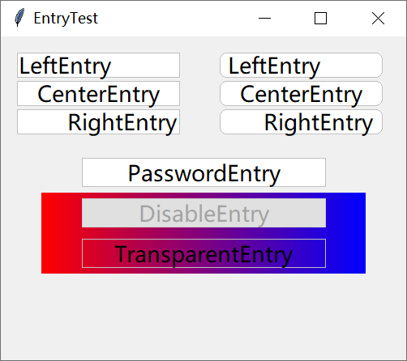
    
    <details><summary><b>源代码</b></summary>

    ```python
    import tkintertools as tkt

    root = tkt.Tk('EntryTest', 500, 400)
    canvas = tkt.Canvas(root, 500, 400, 0, 0)


    def colorful(x, y, width, height):  # type: (int, int, int, int) -> None
        """ Gradient colors """
        for i in range(width):
            color = tkt.color(('#FF0000', '#0000FF'), i/width)
            canvas.create_line(x+i, y, x+i, y+height, fill=color)


    colorful(50, 193, 400, 100)
    tkt.Entry(canvas, 20, 20, 200, 30, text=('LeftEntry', 'Enter'))
    tkt.Entry(canvas, 20, 55, 200, 30, text=(
        'CenterEntry', 'Enter'), justify='center')
    tkt.Entry(canvas, 20, 90, 200, 30, text=(
        'RightEntry', 'Enter'), justify='right')
    tkt.Entry(canvas, 270, 20, 200, 30, radius=8, text='LeftEntry')
    tkt.Entry(canvas, 270, 55, 200, 30, radius=8,
            text='CenterEntry', justify='center')
    tkt.Entry(canvas, 270, 90, 200, 30, radius=8,
            text='RightEntry', justify='right')
    tkt.Entry(canvas, 100, 150, 300, 35, text=('PasswordEntry',
            'Click To Enter'), justify='center', show='●')
    tkt.Entry(canvas, 100, 200, 300, 35, text='DisableEntry',
            justify='center').set_live(False)
    tkt.Entry(canvas, 100, 250, 300, 35, text='TransparentEntry',
            justify='center', color_fill=tkt.COLOR_NONE)

    root.mainloop()
    ```

    </details>

5. `Text`: 文本框控件

    文本框类似于输入框，这里就不再赘述  
    下面是`Text`控件的外观：

    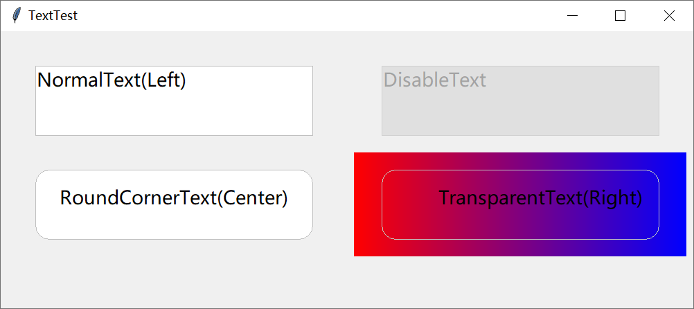
    
    <details><summary><b>源代码</b></summary>

    ```python
    import tkintertools as tkt

    root = tkt.Tk('TextTest', 1000, 400)
    canvas = tkt.Canvas(root, 1000, 400, 0, 0)


    def colorful(x, y, width, height) -> None:  # type: (int, int, int, int) -> None
        """ Gradient colors """
        for i in range(width):
            color = tkt.color(('#FF0000', '#0000FF'), i/width)
            canvas.create_line(x+i, y, x+i, y+height, fill=color)


    colorful(510, 175, 480, 150)
    tkt.Text(canvas, 50, 50, 400, 100, text=('NormalText(Left)', 'Click To Enter'))
    tkt.Text(canvas, 50, 200, 400, 100, radius=20,
            text='RoundCornerText(Center)', justify='center')
    tkt.Text(canvas, 550, 50, 400, 100, text='DisableText').set_live(False)
    tkt.Text(canvas, 550, 200, 400, 100, radius=20,
            text='TransparentText(Right)', justify='right', color_fill=tkt.COLOR_NONE)

    root.mainloop()
    ```

    </details>

6. `Progressbar`: 进度条控件

    进度条控件相比`tkinter.ttk.Progressbar`，外观上的自由度较大  
    下面是`Progressbar`控件的外观：

    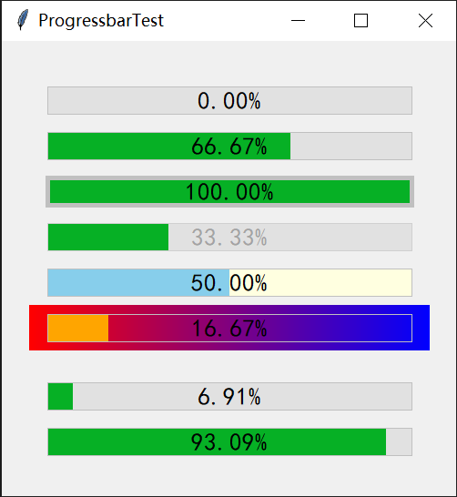

    <details><summary><b>源代码</b></summary>

    ```python
    import tkintertools as tkt

    root = tkt.Tk('ProgressbarTest', 500, 500)
    canvas = tkt.Canvas(root, 500, 500, 0, 0)


    def colorful(x, y, width, height) -> None:  # type: (int, int, int, int) -> None
        """ Gradient colors """
        for i in range(width):
            color = tkt.color(('#FF0000', '#0000FF'), i/width)
            canvas.create_line(x+i, y, x+i, y+height, fill=color)


    colorful(30, 290, 440, 50)
    tkt.Progressbar(canvas, 50, 50, 400, 30)
    tkt.Progressbar(canvas, 50, 100, 400, 30).load(.6667)
    tkt.Progressbar(canvas, 50, 150, 400, 30, borderwidth=5).load(1)
    (_ := tkt.Progressbar(canvas, 50, 200, 400, 30)).load(0.3333)
    _.set_live(False)
    tkt.Progressbar(canvas, 50, 250, 400, 30, color_bar=(
        'lightyellow', 'skyblue')).load(.5)
    tkt.Progressbar(canvas, 50, 300, 400, 30, color_bar=('', 'orange')).load(.1667)

    progressbar = tkt.Progressbar(canvas, 50, 375, 400, 30)
    progressbar_2 = tkt.Progressbar(canvas, 50, 425, 400, 30)


    def load(total, count=0):  # type: (int, int) -> None
        """ load progressbar """
        progressbar.load(count/total)
        progressbar_2.load(1-count/total)
        if count < total:
            root.after(3, load, total, count+1)


    load(10000)
    root.mainloop()
    ```

    </details>

### Tool Class/工具类

1. `PhotoImage`: 图片类

    `PhotoImage`类继承于`tkinter.PhotoImage`，它是在`tkinter.PhotoImage`的基础上做功能的强化，对 gif 动图有很好的支持，仅需极少量代码即可实现动图的显示，还可以设置动图显示的速度，此外，对 png 类型的图片的支持也有强化，可以在不依赖任何第三方模块或者库的情况下，对 png 图片进行缩放

2. `Singleton`: 单例模式类

    单例模式，不用介绍了吧？通过继承它来使用

### Tool Function/工具函数

1. `move`: <a name="move">移动函数</a>

    移动函数可以轻松地按一定的规律、移动速度、移动时间去移动`tkintertools`模块内的所有对象，同时兼容了`tkinter`内的对象，即`tkinter`中的对象也可以很方便地移动，甚至它还可以移动窗口的位置！

    
    
    <details><summary><b>源代码</b></summary>

    ```python
    import tkintertools as tkt

    root = tkt.Tk('MoveTest', 500, 500)
    canvas = tkt.Canvas(root, 500, 500, 0, 0)
    rect = canvas.create_rectangle(50, 350, 150, 450)


    def move_window(switch=[True]):  # type: (list[bool]) -> None
        tkt.move(root, None, 1000 if switch[0] else -1000, 0, 800, mode='flat')
        switch[0] = not switch[0]


    def move_button(switch=[True]) -> None:  # type: (list[bool]) -> None
        tkt.move(canvas, button, 200 if switch[0]
                else -200, 0, 500, mode='rebound')
        switch[0] = not switch[0]


    def move_rect(switch=[True]):  # type: (list[bool]) -> None
        tkt.move(canvas, rect, 200 if switch[0] else -200, 0, 500, mode='smooth')
        switch[0] = not switch[0]


    tkt.Button(canvas, 50, 50, 200, 40, radius=10,
            text='MoveWindow', command=move_window)
    tkt.Button(canvas, 50, 100, 200, 40, radius=10,
            text='MoveRect', command=move_rect)
    button = tkt.Button(canvas, 50, 150, 200, 40, radius=10,
                        text='MoveButton', command=move_button)

    root.mainloop()
    ```

    </details>

2. `text`: 文本函数

    可以快速并方便地得到一个参数长度的字符串，且字符串的内容可以指定位置  
    如：得到一个 20 长度的字符串 “tkintertools”  
    <pre>
    `left`   : "tkintertools        "  
    `center` : "    tkintertools    "  
    `right`  : "        tkintertools"</pre>

3. `color`: <a name="Gradient">颜色函数</a>

    颜色函数可以轻松求出一个颜色到另外一个颜色的过渡颜色，因此可以轻松得到渐变色的效果，同时，改变传入的参数还可以得到传入颜色的对比色  
    第二张图是 test.py 在图像测试中绘制的图案

    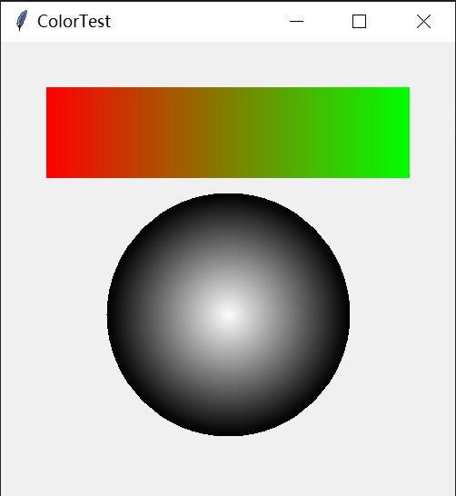

    

    <details><summary><b>源代码</b></summary>

    ```python
    import tkintertools as tkt

    root = tkt.Tk('ColorTest', 500, 500)
    canvas = tkt.Canvas(root, 500, 500, 0, 0)


    def colorful(x, y, width, height):  # type: (int, int, int, int) -> None
        """ Gradient colors """
        for i in range(width):
            color = tkt.color(('#FF0000', '#00FF00'), i/width)
            color_2 = tkt.color(('#FFFFFF', '#000000'), i/width)
            canvas.create_line(x+i, y, x+i, y+height, fill=color)
            canvas.create_oval(250-i/3, 300-i/3, 250+i/3, 300 +
                            i/3, outline=color_2, width=2)


    colorful(50, 50, 400, 100)
    root.mainloop()
    ```

    </details>

4. `askfont`: 字体选择对话框

    `askfont`函数可以打开默认的字体选择窗口，这个窗口虽然是默认的，但它实际上无法在`tkinter`中打开，因为`tkinter`并没有对应的 API 能够做到这一点。但是，`tkintertools`调用并封装了原生的 tcl 的命令，使得字体选择框能够被我们使用。

    <p></p>

5. `SetProcessDpiAwareness`: <a name="DPI">DPI 级别设置函数</a>

    这个函数实际上只是对函数`ctypes.WinDLL('shcore').SetProcessDpiAwareness`的一个简单包装，其值可为 0、1 和 2，分别代表程序 DPI 的不同级别，那么缩放效果也就不同，`tkintertools`选择的值是 1，但程序默认值实际为 0  
    下面是未执行这个函数的效果
    
    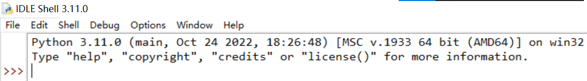

    <p>下面是执行了这个函数的效果</p>

    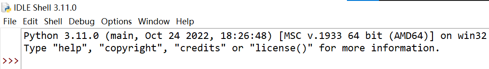

    从上面的两张图中可以很明显的看出第一张很模糊，第二张很清晰，这就是 DPI 级别不同的原因，不过这一点在屏幕缩放比不是 100% 的时候才会出现  
    大家对上面的图肯定很熟悉，这不就是 IDLE 吗！？对，这个的问题的解决办法也是来自于 IDLE 的源代码 [pyshell.py line 18~20]  
    注意：该函数在程序的不同位置执行的效果不一样！一般用在`mainloop`之前，但`tkintertools`已经在`mainloop`函数中嵌入了该函数，无需再设置一次 DPI 级别，此函数是为了原生`tkinter`程序用的。

Examples/实战示例
----------------

以下三个为使用了 tkintertools 的典型案例，供大家参考，程序均免费，源代码开放！  
前面两个是我一边改进 tkintertools 模块，一边写的实战，有一定的 bug，但不影响正常使用。  
只有把模块真正地用到实战上去，才知道哪有 bug，哪里还需要改进！

### 任务清单小工具

* 文章链接: https://xiaokang2022.blog.csdn.net/article/details/128561339
* 代码仓库: https://gitcode.net/weixin_62651706/todolist
* 程序下载(含打包好的程序和源代码): https://wwc.lanzoum.com/iyxL30kpkcbe
* 推荐指数: 👍

这个案例使用了 tkintertools-v2.5.7 版本（新版已无法兼容），含有一些 bug，大量采用了 tkintertools 的控件，取得了比较好的界面效果。体现了 tkintertools 模块与 tkinter 模块相比在颜值上的碾压性！

<p>
    
    
</p>

### 中国象棋游戏

* 文章链接: https://xiaokang2022.blog.csdn.net/article/details/128852029
* 代码仓库: https://gitcode.net/weixin_62651706/chess
* 程序下载(含打包好的程序和源代码): https://wwc.lanzoum.com/iwgp00mlewpa
* 推荐指数: 👍👍

注意：源代码有解压密码，解压密码在链接文章中，请仔细查找！  
这个案例使用了 tkintertools-v2.5.9.5 版本（新版已无法兼容）, 含有少量 bug，部分 UI 采用了 tkintertools，部分 UI 采用了 tkinter，属于混合使用。体现了 tkintertools 模块对 tkinter 模块的兼容性！

<p>
    
    
</p>

### 简易登录界面

* 文章链接: 暂无
* 代码仓库: https://gitcode.net/weixin_62651706/tester
* 程序下载: 暂无
* 推荐指数: 👍👍👍

这个案例使用了最新稳定版的 tkintertools-v2.6.0，界面非常稳定，几乎没有 bug，完全采用 tkintertools 的控件，颜值很高，界面非常流畅。体现了 tkintertools 模块与 tkinter 模块相比在性能上的优越性！

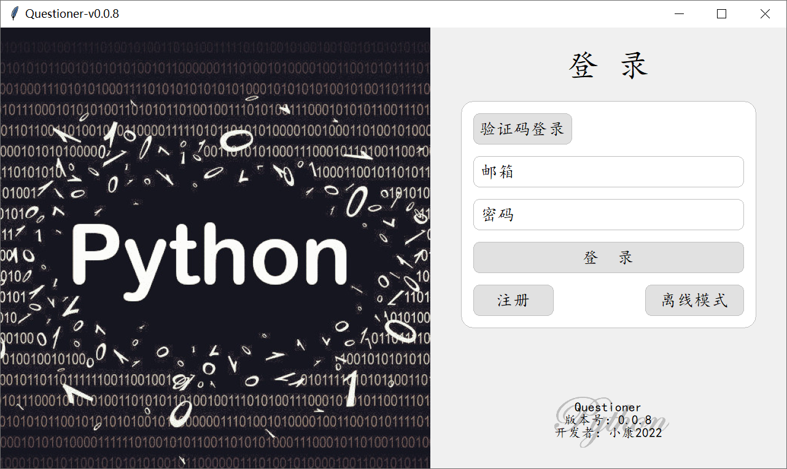


More/更多
---------

> GitHub:  
> https://github.com/Xiaokang2022/tkintertools

> GitCode(Mirror/镜像):  
> https://gitcode.net/weixin_62651706/tkintertools

> Gitee(Mirror/镜像):  
> https://gitee.com/xiaokang-2022/tkintertools

还有更多内容请在 [源代码](./tkintertools/) 中探索！
