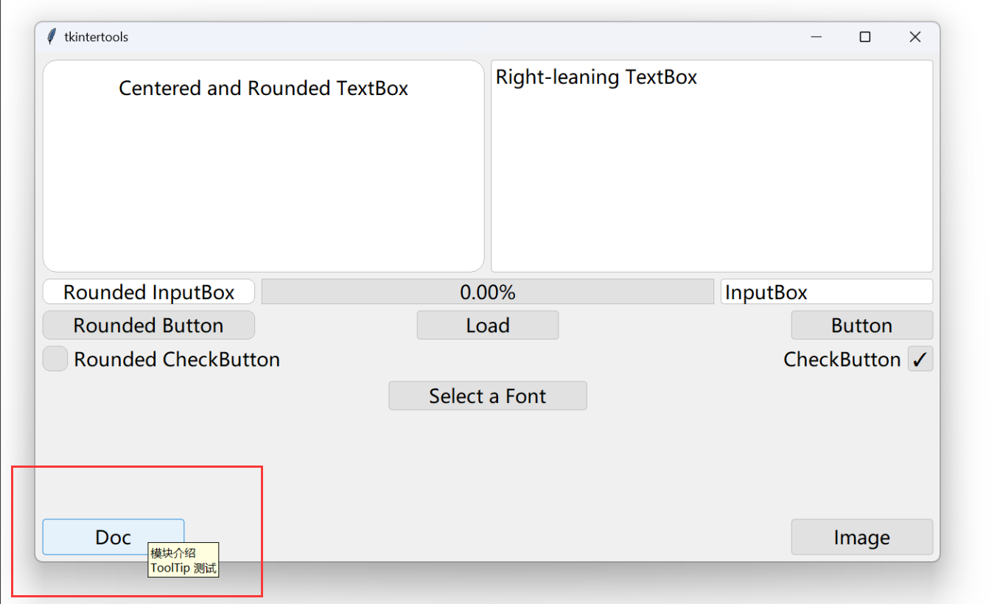

<div align="center">

# 🚀tkintertools🚀


`tkintertools` 模块是 `tkinter` 模块的一个辅助模块\
The `tkintertools` module is an auxiliary module of the `tkinter` module

[](.)
[](LICENSE.txt)
[](CHANGELOG.md)
[](TODO.md)
[](tkintertools)
[](https://github.com/Xiaokang2022/tkintertools/wiki)\
[](https://pypistats.org/packages/tkintertools)
[](https://github.com/Xiaokang2022)
[](https://xiaokang2022.blog.csdn.net)
[](mailto:2951256653@qq.com)

[](https://github.com/Xiaokang2022/tkintertools/pulse)

</div>

Install/模块安装👇
-----------------

### Stable Version/稳定版本

* Version/最新版本 : `2.6.5`
* Release/发布日期 : 2023/06/17 (UTC+08)

这个是目前的最新稳定版，相对于开发版本而言比较稳定，bug 大体上是没有那么多的，推荐使用这个。  
稳定版和开发版相比，它在发布之前有个测试的步骤，经过测试之后（各项功能正常运行，多平台兼容）才会发布。

**PIP Cmd/安装命令：**

```
pip install tkintertools==2.6.5
```

### Development Version/开发版本

* Version/最新版本 : `2.6.6.dev0`
* Release/发布日期 : 2023/06/29 (UTC+08)

这个是我正在开发的版本，可能有新功能，bug 可能会比较多，但也可能会比原来的版本更加稳定。  
开发版没有经过多操作系统的测试，仅能保证在 Windows 系统下运行所有功能，在其他的操作系统上，可能有部分功能无法正常运行。  
大家可以在 Issues 中提出一些建议，我可能会适当采纳一些并在开发版本中更改或实现。

**PIP Cmd/安装命令：**

```
pip install tkintertools==2.6.6.dev0
```

> **Warning**  
> 开发版仅作示例，各函数或类的 API 并非最终确定结果，直接使用开发版可能导致后续无法与稳定版兼容！  
> 若不指定具体的版本号，则会下载最新的稳定版本，也就是说，开发版本只能通过指定的版本号获取！

### Requirements/环境需求

目前稳定版在以下操作系统中已经测试通过:


可能还有其他的操作系统也是可以运行 tkintertools 的，我没有进行更多的验证。  
没有任何额外的依赖包（除了一般 Python 内置的 tkinter），但只支持以下 Python 版本:


News/最新功能👇
--------------

**最新版本: tkintertools-v2.6.6.dev0**

> **Note**  
> 现将开发版（`tkintertools-dev`）合并到稳定版（`tkintertools`）中，版本号格式变为 `*.*.*.dev*`，大家在通过 pip 工具进行下载时请注意！近段时间内将删除 PyPi 上的 tkintertools-dev！

下面是本次版本更新内容条目：

- [X] 新增抽象类 `_3D_Object` 来作为类 `_Point`、`_Line` 和 `_Side` 的元基类；
- [X] 优化了 3D 子模块中的参数传递，使用者不需要时刻保证 `list` 的传递性，且原来只能使用 `list` 类型的参数现在为 `Iterable` 类型；
- [X] 3D 子模块中 3D 对象居中方式改变，相比原来性能提升了不少，代码量也减少了；
- [X] 改正了部分错误的类型提示，完善了部分缺少的方法注释；
- [X] 3D 子模块中原来用函数 `hypot` 计算两点间距离，现在直接用函数 `dist` 计算两点间欧几里得距离，提高性能；
- [X] 3D 子模块中优化了类 `Point` 的控件位置显示，让其始终保持在最前；
- [X] 3D 子模块的类 `Point` 及其父类 `_Point` 的参数 `point1` 和 `point2` 分别被重命名为 `point_start` 和 `point_end`；
- [X] 3D 子模块的类 `Space` 的参数 `origin_color` 被更改为四个新的参数，分别是 `origin_size`、`origin_width`、`origin_fill` 和 `origin_outline`；
- [X] 3D 子模块的类 `Canvas_3D` 和 `Space` 移除参数 `dx` 和 `dy`，画布默认视野保持居中，也就是说，现在它们的中心位置才是原来的左上角顶点；

下面是一个主要新功能的示例程序，运行下面的示例程序时，其拥有以下功能：

* 按住鼠标左键拖动可以旋转这多个几何体；
* 按住鼠标右键拖动可以移动这些几何体在空间中的位置；
* 滚动鼠标中键可以放大和缩小画面；

下面是示例程序的效果图（运行环境为 Windows11-Python3.11.4）：



<details><summary><b>点击查看源代码</b></summary>

```python
import math  # 数学支持

import tkintertools as tkt  # 引入基础模块
from tkintertools import tools_3d as t3d  # 引入 3d 子模块

root = tkt.Tk('3D', 1280, 720)  # 创建窗口
space = t3d.Space(root, 1280, 720, 0, 0)  # 创建空间
last_point = [0, 100*math.cos(-math.pi/3), 100*math.sin(-math.pi/3)]
color_lst = ['red', 'orange', 'yellow', 'green', 'blue', 'purple']
color_lst += color_lst

for i in range(6):
    rad = i*math.pi/3
    next_point = [0, 100*math.cos(rad), 100*math.sin(rad)]
    point_h2 = [0, 150*math.cos(rad), 150*math.sin(rad)]
    t3d.Line(space, last_point, next_point, width=3, fill=color_lst[i])
    t3d.Line(space, next_point, point_h2, width=3, fill=color_lst[i+1])
    t3d.Point(space, last_point, size=20, fill=color_lst[i+2])
    t3d.Point(space, point_h2, size=10, fill=color_lst[i+3])
    last_point = next_point

space.space_sort()  # 给它们的空间位置排序以正确显示
root.mainloop()  # 消息事件循环
```

</details>

More/更多👇
-----------

[](https://github.com/Xiaokang2022/tkintertools)
[](https://gitee.com/xiaokang-2022/tkintertools)
[](https://gitcode.net/weixin_62651706/tkintertools)\
[](https://github.com/Xiaokang2022/tkintertools/watchers)
[](https://github.com/Xiaokang2022/tkintertools/forks)
[](https://github.com/Xiaokang2022/tkintertools/stargazers)
[](https://github.com/Xiaokang2022/tkintertools/graphs/contributors)
[](https://github.com/Xiaokang2022/tkintertools/issues)
[](https://github.com/Xiaokang2022/tkintertools/pulls)
