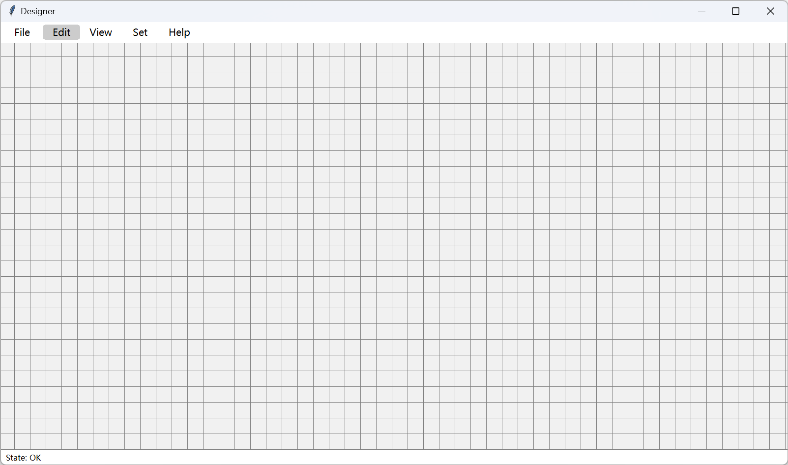

# Release Notes - 版本发布说明

!!! info "Note - 说明"
    This section is still in development...  
    此部分仍在开发中...

## Framework - 框架

- Version - 最新版本 : `3.0.0.alpha3`
- Last Update - 上次更新 : 2024/02/20

Fixed a few bugs and added a lot of content to the framework  
修复些许 bug，框架内增加大量内容

## Designer - 设计器

Version - 版本: `0.0.2`

The designer is in development mode  
设计器已进入开发状态

### Light Theme - 明亮主题



### Dark Theme - 暗黑主题


### Start Designer - 启动设计器

You can start using the command below  
你可以使用下面的命令启动

```bash
python -m tkintertools [options]
```

In addition to this, you can also run the following Python code to start  
除此之外，你还可以运行下面的 Python 代码启动

```python
from tkintertools import designer

designer.run([options])
```

`[options]` above is optional  
上述的 `[options]` 为可选参数