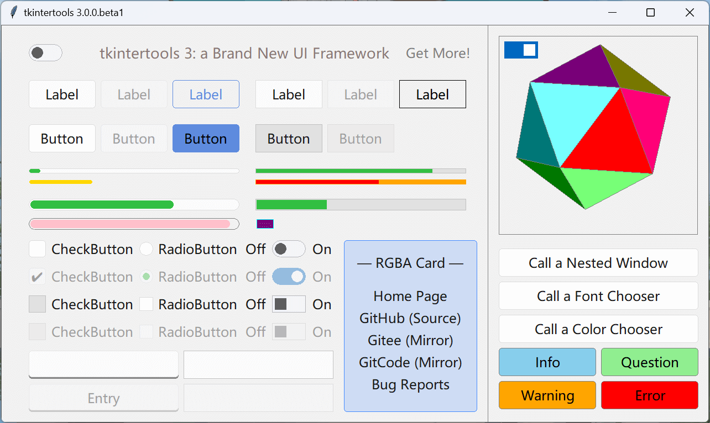
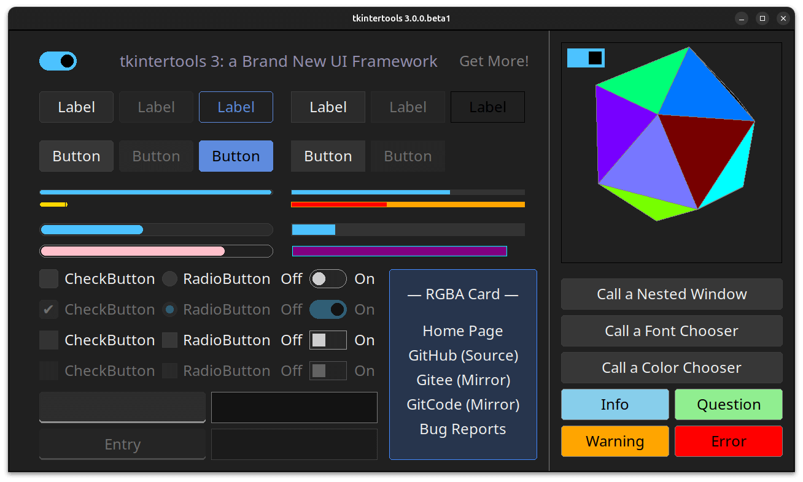

# Release Notes - 版本发布说明

## Framework - 框架

- 🔖 Version - 最新版本 : `3.0.0.beta2`
- 🕓 Last Update - 上次更新 : 2024/06/03

```sh linenums="0"
pip install tkintertools==3.0.0b2
```

Updates can be found at: [Changelog](../../CHANGELOG.md)  
更新内容见：[更新日志](../../CHANGELOG.md)

## Preview - 预览

### Demo1

```python
```

### Demo2

```python
```


### Windows 11




### Windows 10


### macOS


### Ubuntu 24.04 (GNOME)




### Kubuntu 24.04 (KDE)


### Demo Code

```python
import itertools
import math
import random
import statistics
import webbrowser

import tkintertools as tkt
import tkintertools.animation as animation
import tkintertools.color as color
import tkintertools.constants as constants
import tkintertools.standard.dialogs as dialogs  # Customied
import tkintertools.standard.features as features  # Customied
import tkintertools.standard.shapes as shapes  # Customied
import tkintertools.standard.texts as texts  # Customied
import tkintertools.style as style
import tkintertools.three as three

root = tkt.Tk(title=f"tkintertools {tkt.__version__}")
root.center()
canvas = tkt.Canvas(root, zoom_item=True, keep_ratio="full",
                    free_anchor=True, highlightthickness=1, highlightbackground="grey")
canvas.place(width=1280, height=720, x=640, y=360, anchor="center")
canvas.create_line(880, 0, 880, 800, fill="grey")

# constants.SYSTEM = "Windows10"
# constants.FONT = "霞鹜文楷 屏幕阅读版"

ORIGIN_SYSTEM = constants.SYSTEM

"""
Data Card (RGBA - Experimental)
"""

_l = tkt.Label(canvas, (620, 390), (240, 310), name="")
_l.shapes[0].styles = {"normal": {"fill": "#448AFF33", "outline": "#448AFF"},
                       "hover": {"fill": "#00BFA533", "outline": "#00BFA5"}}
_l.update()

tkt.Information(canvas, (740, 430), text="— RGBA Card —")
tkt.UnderlineButton(canvas, (740, 490), text="Home Page", through=True,
                    command=lambda: webbrowser.open_new_tab("https://xiaokang2022.github.io/tkintertools/"))
tkt.UnderlineButton(canvas, (740, 530), text="GitHub (Source)", through=True,
                    command=lambda: webbrowser.open_new_tab("https://github.com/Xiaokang2022/tkintertools"))
tkt.UnderlineButton(canvas, (740, 570), text="Gitee (Mirror)", through=True,
                    command=lambda: webbrowser.open_new_tab("https://gitee.com/xiaokang-2022/tkintertools"))
tkt.UnderlineButton(canvas, (740, 610), text="GitCode (Mirror)", through=True,
                    command=lambda: webbrowser.open_new_tab("https://gitcode.com/Xiaokang2022/tkintertools"))
tkt.UnderlineButton(canvas, (740, 650), text="Bug Reports", through=True,
                    command=lambda: webbrowser.open_new_tab("https://github.com/Xiaokang2022/tkintertools/issues"))


"""
Here's the customization section
"""


class MyCustomWidget(tkt.Widget):
    """"""

    def __init__(self, *args, **kw) -> None:
        super().__init__(*args, **kw)


class MyToplevel(tkt.Toplevel):
    """My Customized Toplevel"""

    def __init__(self, *args, **kw) -> None:
        constants.SYSTEM = ORIGIN_SYSTEM
        super().__init__(*args, size=(720, 405), **kw)
        self.topmost(True)
        self.center(self.master)
        self.canvas = canvas = tkt.Canvas(self, free_anchor=True, expand="")
        canvas.place(width=720, height=405, x=360, y=202, anchor="center")
        canvas.create_rectangle(40, 40, 120, 120, dash="-", outline="grey")
        canvas.create_text(80, 25, text="Shape", fill="grey")
        self.s = canvas.create_text(80, 80, fill="red", justify="center")
        canvas.create_line(120, 80, 180, 80, 180, 160, 220,
                           160, fill="grey", arrow="last")
        canvas.create_rectangle(40, 160, 120, 240, dash="-", outline="grey")
        canvas.create_text(80, 145, text="Text", fill="grey")
        canvas.create_line(120, 202.5, 220, 202.5, fill="grey", arrow="last")
        canvas.create_rectangle(40, 280, 120, 360, dash="-", outline="grey")
        canvas.create_text(80, 265, text="Image", fill="grey")
        canvas.create_line(120, 320, 180, 320, 180, 240,
                           220, 240, fill="grey", arrow="last")
        canvas.create_rectangle(540, 40, 680, 120, dash="-", outline="grey")
        canvas.create_text(610, 25, text="Feature", fill="grey")
        self.f = canvas.create_text(610, 80, fill="purple")
        canvas.create_line(610, 120, 610, 202.5, 500,
                           202.5, fill="grey", arrow="last")
        canvas.create_rectangle(220, 70, 500, 350, dash=".", outline="red")
        canvas.create_text(360, 40, text="Widget", fill="red")

        self.shape: tkt.Shape = None
        self.text: tkt.Text = None
        self.image: tkt.Image = None
        self.feature: tkt.Feature = None
        self.style: dict = None
        self.widget: tkt.Widget = None

        tkt.Button(canvas, (585, 275), text="Clear", command=self.clear)
        tkt.Button(canvas, (585, 340), text="Generate", command=self.generate)

    def generate(self) -> None:
        """Generate a Widget randomly"""
        self.clear()
        self.shape = random.choice([shapes.Rectangle, shapes.Oval, shapes.Parallelogram, shapes.SharpRectangle,
                                   shapes.RegularPolygon, shapes.RoundedRectangle, shapes.SemicircularRectangle])
        self.feature = random.choice(
            [features.Label, features.Button, features.UnderLine, features.Highlight])
        self.text = texts.Information
        self.widget = tkt.Widget(self.canvas, (300, 162), (120, 80))
        kw = {}
        match self.shape:
            case shapes.RegularPolygon: kw["side"] = random.randint(3, 9)
            case shapes.Parallelogram: kw["theta"] = random.uniform(-math.pi/6, math.pi/3)
            case shapes.RoundedRectangle: kw["radius"] = random.randint(4, 25)
            case shapes.SharpRectangle:
                kw["theta"] = random.uniform(math.pi/6, math.pi/3)
                kw["ratio"] = random.uniform(0, 1), random.uniform(0, 1)
        try:
            _s = self.shape(self.widget, **kw)
            self.shape = self.shape(self.widget, (-280, -120), **kw)
            _s.styles = self.shape.styles = {
                "normal": {"fill": self.randcolor(), "outline": self.randcolor()},
                "hover": {"fill": self.randcolor(), "outline": self.randcolor()},
                "active": {"fill": self.randcolor(), "outline": self.randcolor()},
            }
        except:
            self.canvas.itemconfigure(self.s, text="Param\nError")
        _t = self.text(self.widget, text="TKT")
        self.text = self.text(self.widget, (-280, 0), text="TKT")
        _t.styles = self.text.styles = {
            "normal": {"fill": self.randcolor()},
            "hover": {"fill": self.randcolor()},
            "active": {"fill": self.randcolor()},
        }
        self.canvas.itemconfigure(self.f, text=self.feature.__name__)
        self.feature = self.feature(self.widget)
        self.widget.update()

    def randcolor(self) -> str:
        """Get a random color string"""
        num = random.randint(0, (1 << 24) - 1)
        return f"#{num:06X}"

    def clear(self) -> None:
        """Clear Widget"""
        if self.widget is not None:
            self.widget.destroy()
            self.widget = None
        self.canvas.itemconfigure(self.s, text="")
        self.canvas.itemconfigure(self.f, text="")


"""
Below is the section of the style following system
"""

tkt.Switch(canvas, (50, 35), command=lambda b: style.use_theme(
    "dark" if b else "light"), default=style.DARK_MODE)


i = canvas.create_text(
    440, 50, text="tkintertools 3: a Brand New UI Framework", font=26)

tkt.HighlightButton(canvas, (790, 50), text="Get More!", command=MyToplevel)

tkt.Button(canvas, (900, 405), (360, 50),
           text="Call a Nested Window", command=tkt.NestedToplevel)
tkt.Button(canvas, (900, 465), (360, 50),
           text="Call a Font Chooser", command=dialogs.FontChooser)
tkt.Button(canvas, (900, 525), (360, 50),
           text="Call a Color Chooser", command=dialogs.ColorChooser)

info = tkt.Button(canvas, (900, 585), (175, 50), name="",
                  text="Info", command=lambda: dialogs.Message(icon="info"))
info.shapes[0].styles = {"normal": {"fill": "skyblue", "outline": "grey"}}
info.update()
question = tkt.Button(canvas, (900 + 185, 585), (175, 50), name="",
                      text="Question", command=lambda: dialogs.Message(icon="question"))
question.shapes[0].styles = {"normal": {
    "fill": "lightgreen", "outline": "grey"}}
question.update()
warning = tkt.Button(canvas, (900, 645), (175, 50), name="",
                     text="Warning", command=lambda: dialogs.Message(icon="warning"))
warning.shapes[0].styles = {"normal": {"fill": "orange", "outline": "grey"}}
warning.update()
error = tkt.Button(canvas, (900 + 185, 645), (175, 50), name="",
                   text="Error", command=lambda: dialogs.Message(icon="error"))
error.shapes[0].styles = {"normal": {"fill": "red", "outline": "grey"}}
error.update()


random_color = f"#{random.randint(0, (1 << 24) - 1):06X}"
contast_color = color.rgb_to_str(
    color.contrast(color.str_to_rgb(random_color)))


animation.Gradient(canvas, i, "fill", 2000, (random_color, contast_color),
                   repeat=-1, controller=lambda x: math.sin(x*math.pi)).start()


"""
Here's the part for customizing the system
"""


constants.SYSTEM = "Windows11"

tkt.Label(canvas, (50, 100), (120, 50), text="Label")
tkt.Label(canvas, (180, 100), (120, 50), text="Label").disabled()
l = tkt.Label(canvas, (310, 100), (120, 50), text="Label", name="")
l.shapes[0].styles = {"normal": {"fill": "", "outline": "#5E8BDE"},
                      "hover": {"fill": "", "outline": "#FFAC33"}}
l.texts[0].styles = {"normal": {"fill": "#5E8BDE"},
                     "hover": {"fill": "#FFAC33"}}
l.update()

tkt.Button(canvas, (50, 180), (120, 50), text="Button")
tkt.Button(canvas, (180, 180), (120, 50), text="Button").disabled()
b = tkt.Button(canvas, (310, 180), (120, 50), text="Button", name="")
b.shapes[0].styles = {"normal": {"fill": "#5E8BDE", "outline": "#5E8BDE"},
                      "hover": {"fill": "#CCCC00", "outline": "#CCCC00"},
                      "active": {"fill": "#FFAC33", "outline": "#FFAC33"}}
b.update()

pb1 = tkt.ProgressBar(canvas, (50, 260), (380, 8))
pb2 = tkt.ProgressBar(canvas, (50, 280), (380, 8), name="")

pb2.shapes[0].styles = {"normal": {"fill": "", "outline": ""}}
pb2.shapes[1].styles = {"normal": {"fill": "gold", "outline": "gold"}}
pb2.shapes[1].disappear()
pb2.update()

animation.Animation(2000, animation.smooth, callback=pb1.set,
                    fps=60, repeat=math.inf).start(delay=1500)
animation.Animation(2000, animation.smooth, callback=pb2.set,
                    fps=60, repeat=math.inf).start(delay=1000)

pb3 = tkt.ProgressBar(canvas, (50, 315), (380, 20))
pb4 = tkt.ProgressBar(canvas, (50, 350), (380, 20), name="")

pb4.shapes[0].styles = {"normal": {"fill": "", "outline": "grey"}}
pb4.shapes[1].styles = {"normal": {"fill": "pink", "outline": "pink"}}
pb4.shapes[1].disappear()
pb4.update()

animation.Animation(2000, animation.smooth, callback=pb3.set,
                    fps=60, repeat=math.inf).start(delay=500)
animation.Animation(2000, animation.smooth, callback=pb4.set,
                    fps=60, repeat=math.inf).start()

tkt.CheckButton(canvas, (50, 390))
tkt.Information(canvas, (165, 390 + 15), text="CheckButton")
tkt.RadioButton(canvas, (250, 390 + 3))
tkt.Information(canvas, (355, 390 + 15), text="RadioButton")
tkt.Information(canvas, (460, 390 + 15), text="Off")
tkt.Switch(canvas, (490, 390))
tkt.Information(canvas, (580, 390 + 15), text="On")

tkt.CheckButton(canvas, (50, 440), default=True).disabled()
tkt.Information(canvas, (165, 440 + 15), text="CheckButton").disabled()
tkt.RadioButton(canvas, (250, 440 + 3), default=True).disabled()
tkt.Information(canvas, (355, 440 + 15), text="RadioButton").disabled()
tkt.Information(canvas, (460, 440 + 15), text="Off").disabled()
tkt.Switch(canvas, (490, 440), default=True).disabled()
tkt.Information(canvas, (580, 440 + 15), text="On").disabled()

tkt.Entry(canvas, (50, 595 - 5), (270, 50))
e = tkt.Entry(canvas, (50, 655 - 5), (270, 50))
e.set("Entry")
e.disabled()

constants.SYSTEM = "Windows10"

tkt.Label(canvas, (50 + 410, 100), (120, 50), text="Label")
tkt.Label(canvas, (180 + 410, 100), (120, 50), text="Label").disabled()
tkt.Label(canvas, (310 + 410, 100), (120, 50), text="Label", name="")

tkt.Button(canvas, (50 + 410, 180), (120, 50), text="Button")
tkt.Button(canvas, (180 + 410, 180), (120, 50), text="Button").disabled()
b2 = tkt.Button(canvas, (310 + 410, 180), (120, 50), text="Button", name="")

b2.shapes[0].styles = {"normal": {"fill": "", "outline": ""},
                       "hover": {"fill": "yellow", "outline": "red"}}
b2.texts[0].styles = {"normal": {"fill": ""},
                      "hover": {"fill": "black"}}
b2.update()

pb5 = tkt.ProgressBar(canvas, (50 + 410, 260), (380, 8))
pb6 = tkt.ProgressBar(canvas, (50 + 410, 280), (380, 8), name="")

pb6.shapes[0].styles = {"normal": {"fill": "orange", "outline": "orange"}}
pb6.shapes[1].styles = {"normal": {"fill": "red", "outline": "red"}}
pb6.shapes[1].disappear()
pb6.update()

animation.Animation(2000, animation.flat, callback=pb5.set,
                    fps=60, repeat=math.inf).start()
animation.Animation(2000, animation.flat, callback=pb6.set,
                    fps=60, repeat=math.inf).start(delay=500)

pb7 = tkt.ProgressBar(canvas, (50 + 410, 315), (380, 20))
pb8 = tkt.ProgressBar(canvas, (50 + 410, 350), (380, 20), name="")

pb8.shapes[0].styles = {"normal": {"fill": "", "outline": ""}}
pb8.shapes[1].styles = {"normal": {"fill": "purple", "outline": "cyan"}}
pb8.shapes[1].disappear()
pb8.update()

animation.Animation(2000, animation.flat, callback=pb7.set,
                    fps=60, repeat=math.inf).start(delay=1000)
animation.Animation(2000, animation.flat, callback=pb8.set,
                    fps=60, repeat=math.inf).start(delay=1500)

tkt.CheckButton(canvas, (50, 490))
tkt.Information(canvas, (165, 490 + 15), text="CheckButton")
tkt.RadioButton(canvas, (250, 490 + 3))
tkt.Information(canvas, (355, 490 + 15), text="RadioButton")
tkt.Information(canvas, (460, 490 + 15), text="Off")
tkt.Switch(canvas, (490, 490))
tkt.Information(canvas, (580, 490 + 15), text="On")

tkt.CheckButton(canvas, (50, 540)).disabled()
tkt.Information(canvas, (165, 540 + 15), text="CheckButton").disabled()
tkt.RadioButton(canvas, (250, 540 + 3)).disabled()
tkt.Information(canvas, (355, 540 + 15), text="RadioButton").disabled()
tkt.Information(canvas, (460, 540 + 15), text="Off").disabled()
tkt.Switch(canvas, (490, 540)).disabled()
tkt.Information(canvas, (580, 540 + 15), text="On").disabled()

tkt.Entry(canvas, (50 + 280, 595 - 5), (270, 50))
tkt.Entry(canvas, (50 + 280, 655 - 5), (270, 50)).disabled()

"""
Here's the 3D part
"""


space = three.Space(canvas, free_anchor=True, zoom_item=True,
                    highlightthickness=1, highlightbackground="grey")
space.place(width=360, height=360, x=900, y=20)
space.update()

m = 150 * math.sqrt(50 - 10 * math.sqrt(5)) / 10
n = 150 * math.sqrt(50 + 10 * math.sqrt(5)) / 10
points = []
dis_side = 150 * (3 * math.sqrt(3) + math.sqrt(15)) / 12 / \
    ((math.sqrt(10 + 2 * math.sqrt(5))) / 4)
count, color_lst = 0, ['00', '77', 'FF']
colors = [f'#{r}{g}{b}' for r in color_lst for g in color_lst for b in color_lst]

for i in m, -m:
    for j in n, -n:
        points.append([0, j, i])
        points.append([i, 0, j])
        points.append([j, i, 0])

for p in itertools.combinations(points, 3):
    dis = math.hypot(*[statistics.mean(c[i] for c in p) for i in range(3)])
    if math.isclose(dis, dis_side):
        three.Side(space, *p, fill=colors[count], outline='grey')
        count += 1


space.space_sort()


count = 0


def _callback(_: float) -> None:
    """callback function of animation"""
    global count
    count += 0.08
    for item in space.items_3d():
        item.rotate(dy=-0.01, dz=0.02)
        item.translate(dz=math.sin(count))
        item.update()
    space.space_sort()


an = animation.Animation(2000, animation.flat, callback=_callback,
                         fps=60, repeat=-1, derivation=True)


tkt.Switch(space, (10, 10), command=lambda flag: an.start()
           if flag else an.stop())

root.mainloop()
```
