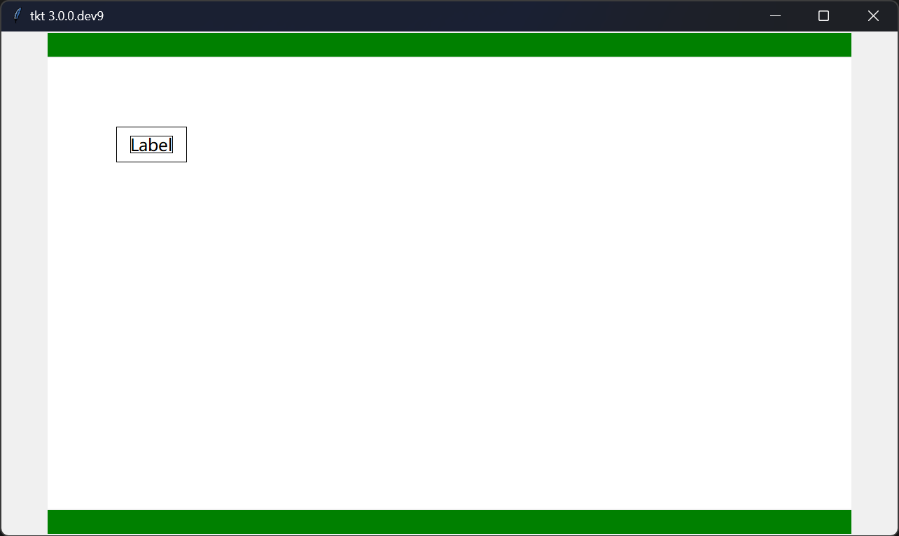

Release Notes / 版本说明
=======================

* Version / 最新版本 : `3.0.0.dev5`
* Release / 发布日期 : 

```

```

Example / 样例演示
-----------------

* OS / 操作系统 : Windows11 22H2
* Interpreter / 解释器 : Python 3.12.0



<details><summary><b>Source Code / 源代码</b></summary>

```python
import tkintertools_dev as tkt

tk = tkt.Tk(title="666")
tk.after(1, tk.center)

nestedTk = tkt.NestedTk(tk, size_expand="xy", position_expand="xy")
# nestedTk.after(1, nestedTk.center)

nestedTk_2 = tkt.NestedTk(nestedTk, size_expand="xy",
                          position_expand="xy", size=(320, 180))

# toplevel = tkt.Toplevel(tk, state="zoomed")
# toplevel.center()

tk.mainloop()
```

</details>

ChangeLog / 更新日志
-------------------

...

Todos / 待办事项
---------------

...

---
[Last Version / 上个版本](../2.6.11/News.md) | Next Version / 下个版本
