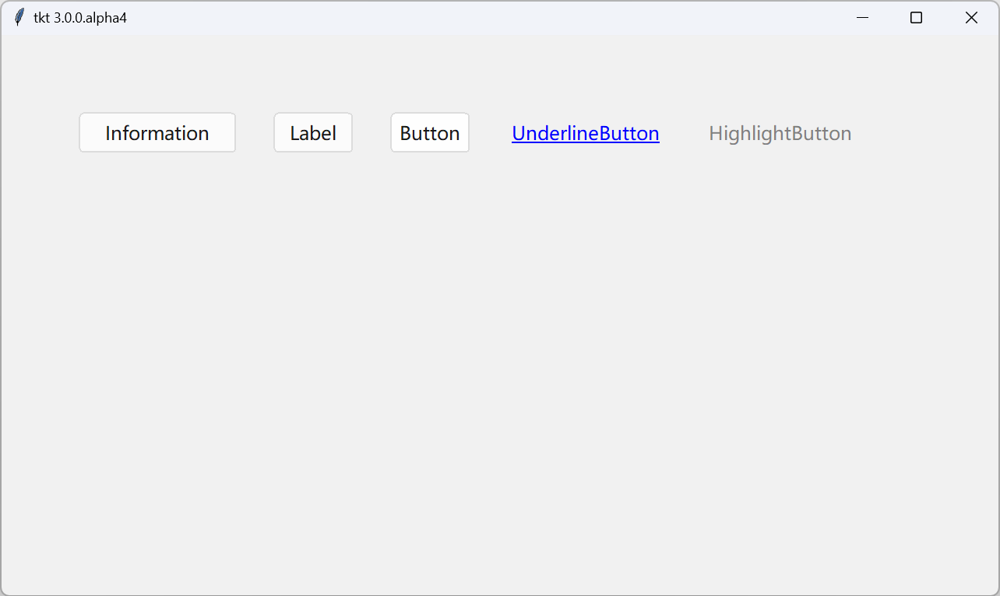
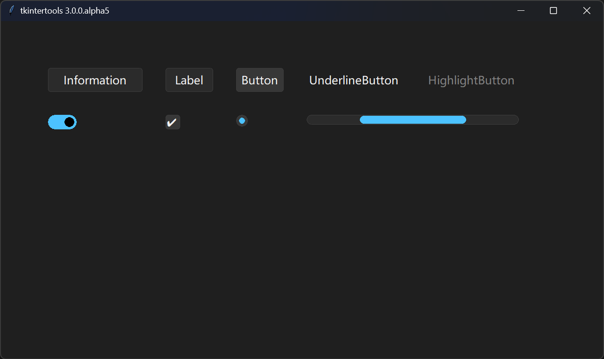

# Release Notes - 版本发布说明

!!! info "Note - 说明"

    This section is still in development...

    此部分仍在开发中...

## Framework - 框架

-   Version - 最新版本 : `3.0.0.alpha4`
-   Last Update - 上次更新 : 2024/04/05

The 3D submodule of `tkt 2` was successfully ported to `tkt 3`  
成功将 `tkt 2` 的 3D 子模块移植到 `tkt 3` 上

A lot of bugs have been fixed, and a lot of content has been improved within the framework  
修复大量 bug，框架内完善大量内容

The UI has been updated to provide both Windows 10 and Windows 11 style dark and bright themes  
UI 更新，提供 Windows 10 和 Windows 11 风格的暗黑与明亮两套主题

- **Light Mode (Windows 11)**



- **Dark Mode (Windows 11)**



!!! note "Example Code"

    ```python
    import webbrowser

    import tkintertools as tkt

    root = tkt.Tk(title=f"tkt {tkt.__version__}")
    root.center()

    canvas = tkt.Canvas(root, free_anchor=True, keep_ratio="full",
                        zoom_item=True, highlightthickness=1)
    canvas.place(width=1280, height=720, x=640, y=360, anchor="center")

    tkt.Information(canvas, (100, 100), (200, 50), text="Information")
    tkt.Label(canvas, (350, 100), (100, 50), text='Label')
    tkt.Button(canvas,  (500, 100), (100, 50),
            text='Button', command=lambda: print("Button"))
    tkt.UnderlineButton(canvas, (650, 100), (200, 50), text='UnderlineButton',
                        command=lambda: webbrowser.open_new_tab("https://github.com/Xiaokang2022/tkintertools"))
    tkt.HighlightButton(canvas, (900, 100), (200, 50), text='HighlightButton',
                        command=lambda: webbrowser.open_new_tab("https://github.com/Xiaokang2022/tkintertools"))

    root.mainloop()
    ```

## Designer - 设计器

The designer is in development mode  
设计器已进入开发状态

### Light Theme - 明亮主题


### Dark Theme - 暗黑主题


### Start Designer - 启动设计器

You can start using the command below  
你可以使用下面的命令启动

```sh linenums="0"
python -m tkintertools [options]
```

In addition to this, you can also run the following Python code to start  
除此之外，你还可以运行下面的 Python 代码启动

```python
from tkintertools import designer

designer.run([options])
```

`[options]` above is optional  
上述的 `[options]` 为可选参数
