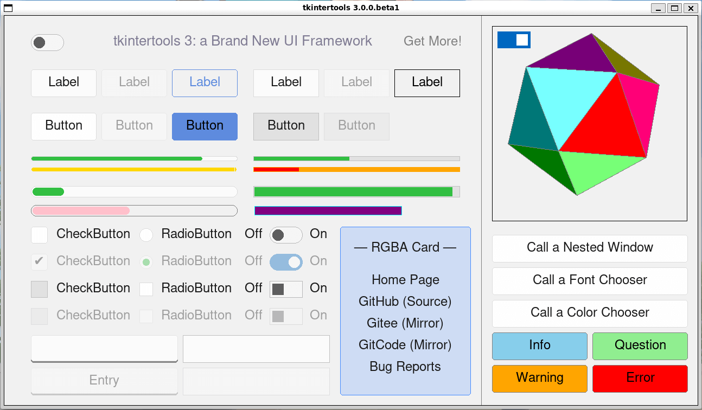
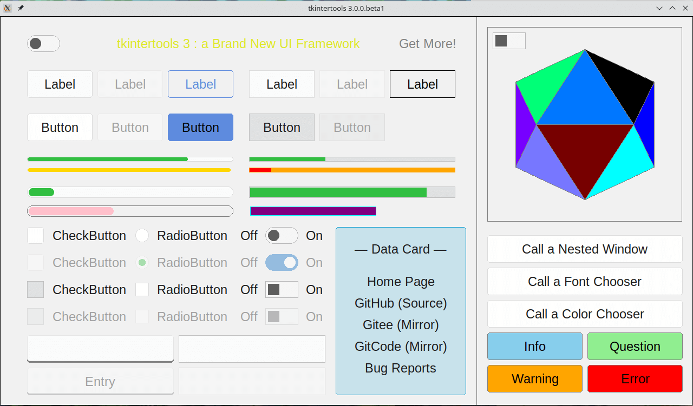
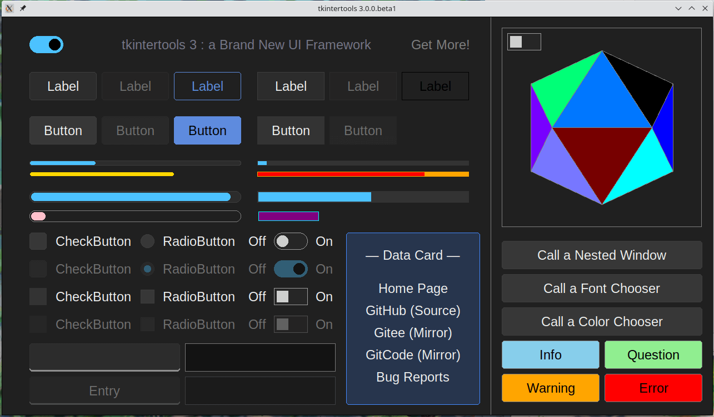

# Release Notes - 版本发布说明

## Framework - 框架

- 🔖 Version - 最新版本 : `3.0.0.beta1`
- 🕓 Last Update - 上次更新 : 2024/05/17

```sh linenums="0"
pip install tkintertools==3.0.0b1
```

### Change Things - 更新内容

🟢 **Added - 新增**

- The docstrings for a portion of the code has been added  
添加了一部分代码的文本字符串

- Added the animation class `MoveItem` to move items on the canvas  
增加了动画类 `MoveItem` 来移动画布上的 Item

- The animation base class `Animation` adds the initialization parameter `derivation` to control whether the parameters of the callback function are derived  
动画基类 `Animation` 增加了初始化参数 `derivation` 来控制回调函数的参数是否求导

- The subpackage `color` adds the module `colormap` to speed up the conversion of color names to their corresponding RGB codes  
子包 `color` 增加了模块 `colormap` 来加速颜色名称到其对应 RGB 码的转换速度

- The subpackage `color` adds the functions `contrast`, `convert`, `blend` and `gradient` to complete the color processing mechanism  
子包 `color` 新增函数 `contrast`、`convert`、`blend` 和 `gradient` 来完善颜色处理机制的功能

- The subpackage `style` adds the module `theme` to control the overall theme of the application  
子包 `style` 新增模块 `theme` 来控制应用程序整体的主题

- Added method `disabled` to the widget class to disable it. If a style with a disabled state is defined in the stylesheet, the defined style is used, otherwise the style in the disabled state is automatically generated based on the current style (color to background color conversion by a factor of 0.618)  
小部件类新增方法 `disabled` 来使其处于禁用状态。若在样式表中定义了禁用状态的样式，则会使用定义的样式，否则根据当前样式自动生成禁用状态的样式（色彩向背景色转换 0.618 倍）

- The widget `RadioButton` has a new initialization parameter `default` to control its default state  
小部件 `RadioButton` 新增初始化参数 `default` 来控制其默认的状态

- Experimental support for color strings in RGBA format has been added to the Color subpackage  
颜色子包新增对 RGBA 格式的颜色字符串的实验性支持

🟣 **Fixed - 修复**

- Fixed an bug where the animation classes `MoveWidget` and `MoveComponent` were not moving objects to the correct position when they were called repeatedly  
修复了动画类 `MoveWidget` 和 `MoveComponent` 在被反复调用的情况下无法将对象移动到正确位置的问题

- Fixed an bug where the animation class `ScaleFontSize` did not scale the font size correctly  
修复了动画类 `ScaleFontSize` 无法正确缩放字体大小的问题

- Fixed and enhanced a bug with the centering function of container widgets such as `Toplevel`  
修复并增强了容器小部件 `Toplevel` 等在居中功能上的问题

🔵 **Optimized - 优化**

- Optimized the way to get the style file, the widget can set a relative name to reduce the amount of code, and the relative name starts with a decimal point  
优化了样式文件的获取方式，小组件可以设置相对名称来减少代码量，相对名称以小数点开头

- The theme mechanism is optimized, there is no longer a need to write a tag in the style file, and the mapping relationship between the color parameters of the item and the keywords of the style file can be written in the definition of `Shape`, so as to reduce the redundant content in the style file and improve the compatibility between the style files  
主题机制优化，样式文件中不再需要写出 tag，可在 `Shape` 的定义中写明 Item 的颜色参数与样式文件关键字的映射关系，以此缩减样式文件中的冗余内容，提高各样式文件之间的兼容性

- Optimized the appearance of some widgets  
优化部分小部件外观

- Improved cross-platform compatibility  
提高了跨平台的兼容性

- Improved 3D submodule compatibility with the new version of `tkintertools`  
提高了 3D 子模块对新版 `tkintertools` 兼容性

- Change the constants `FONT` and `SIZE` to dynamic values, so that font modifications can take effect globally  
将常量 `FONT` 和 `SIZE` 改成动态取值，便于字体修改可以全局生效

🟡 **Changed - 变更**

- The animation class `Gradient` no longer converts an empty color string to black when it accepts it, but simply throws an exception  
动画类 `Gradient` 在接受空颜色字符串时不再将其转化为黑色，而是直接抛出异常

- The implementation code for the 3D subpackage has been moved from file `three/__init__.py` to file `three/engine.py`  
3D 子包的实现代码从文件 `three/__init__.py` 移动到了文件 `three/engine.py`

- The submodule `style` has been changed to the sub-package `style` and its contents have been reorganized  
子模块 `style` 变更为子包 `style`，其内容进行了重新的整理

🔴 **Removed - 移除**

- Remove the useless class from the submodule `images` of the subpackage `standard`  
移除子包 `standard` 的子模块 `images` 中无用的类

- Remove the function `color` from the color subpack (There are other better implementations)  
移除颜色子包中的函数 `color`（已有其他更好的实现）

🟤 **Refactored - 重构**

- Some of the code has been refactored  
重构了部分代码

## Preview - 预览

### Windows11


### Windows10


### macOS


### WSL




### Kubuntu




