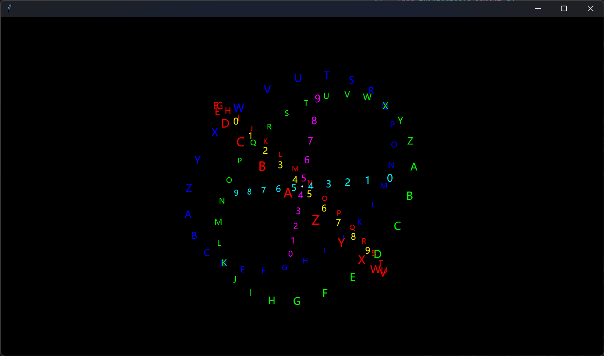

# Release Notes - 版本发布说明

!!! warning "Warning - 警告"

    This section is still in development...

    此部分仍在开发中...

## Framework - 框架

-   Version - 最新版本 : `3.0.0.alpha4`
-   Last Update - 上次更新 : 2024/04/05

### Change Things - 更新内容

- [X] The 3D submodule of `tkt 2` was successfully ported to `tkt 3`  
成功将 `tkt 2` 的 3D 子模块移植到 `tkt 3` 上

- [X] A lot of bugs have been fixed, and a lot of content has been improved within the framework  
修复大量 bug，框架内完善大量内容

- [X] The UI has been updated to provide both Windows 10 and Windows 11 style dark and bright themes  
UI 更新，提供 Windows 10 和 Windows 11 风格的暗黑与明亮两套主题

### Base Test - 基础测试

- **Light Mode (Windows 11)**


- **Dark Mode (Windows 11)**


??? note "Test Code - 测试代码"

    ```python
    import webbrowser

    import tkintertools as tkt

    root = tkt.Tk(title=f"tkt {tkt.__version__}")
    root.center()

    canvas = tkt.Canvas(root, free_anchor=True, keep_ratio="full",
                        zoom_item=True, highlightthickness=1)
    canvas.place(width=1280, height=720, x=640, y=360, anchor="center")

    tkt.Information(canvas, (100, 100), (200, 50), text="Information")
    tkt.Label(canvas, (350, 100), (100, 50), text='Label')
    tkt.Button(canvas,  (500, 100), (100, 50),
            text='Button', command=lambda: print("Button"))
    tkt.UnderlineButton(canvas, (650, 100), (200, 50), text='UnderlineButton',
                        command=lambda: webbrowser.open_new_tab("https://github.com/Xiaokang2022/tkintertools"))
    tkt.HighlightButton(canvas, (900, 100), (200, 50), text='HighlightButton',
                        command=lambda: webbrowser.open_new_tab("https://github.com/Xiaokang2022/tkintertools"))

    root.mainloop()
    ```

### 3D Test - 3D 测试



??? note "Test Code - 测试代码"

    ```python
    import itertools
    import math
    import random
    import statistics
    import tkinter

    import tkintertools as tkt
    from tkintertools import d3

    root = tkt.Tk((1600, 900))
    root.theme(background="black")
    space = d3.Space(root, keep_ratio="full", bg="black", free_anchor=True,
                    highlightbackground="white")
    space.place(width=1600, height=900, x=800, y=450, anchor="center")
    space.update_idletasks()

    r = 300

    O = d3.Point(space, [0, 0, 0], fill='white', size=3)
    X = d3.Line(space, [0, 0, 0], [1, 0, 0], fill='')
    Y = d3.Line(space, [0, 0, 0], [0, 1, 0], fill='')
    Z = d3.Line(space, [0, 0, 0], [0, 0, 1], fill='')

    ring = {'x': [], 'y': [], 'z': []}  # type: dict[str, list[d3.Text3D]]
    line = {'x': [], 'y': [], 'z': []}  # type: dict[str, list[d3.Text3D]]

    for i in range(26):
        t = chr(65+i)
        φ = i/26 * math.tau
        c1 = r * math.sin(φ)
        c2 = r * math.cos(φ)
        ring['x'].append(d3.Text3D(space, [0, c1, c2], text=t, fill='#FF0000'))
        ring['y'].append(d3.Text3D(space, [c1, 0, c2], text=t, fill='#00FF00'))
        ring['z'].append(d3.Text3D(space, [c1, c2, 0], text=t, fill='#0000FF'))

    for i in range(10):
        t = str(i)
        c = (i+1) * 600/11 - r
        line['x'].append(d3.Text3D(space, [c, 0, 0], text=t, fill='#00FFFF'))
        line['y'].append(d3.Text3D(space, [0, c, 0], text=t, fill='#FF00FF'))
        line['z'].append(d3.Text3D(space, [0, 0, c], text=t, fill='#FFFF00'))


    def animation():
        for obj3D in ring['x']:
            obj3D.rotate(0.05, axis=X.coordinates)
        for obj3D in ring['y']:
            obj3D.rotate(0.05, axis=Y.coordinates)
        for obj3D in ring['z']:
            obj3D.rotate(0.05, axis=Z.coordinates)
        for obj3D in line['x']:
            obj3D.rotate(-0.05, axis=Y.coordinates)
        for obj3D in line['y']:
            obj3D.rotate(-0.05, axis=Z.coordinates)
        for obj3D in line['z']:
            obj3D.rotate(-0.05, axis=X.coordinates)
        for obj3D in space.items_3d():
            obj3D.rotate(0, -0.01, 0.01, center=O.center())
            obj3D.update()
        root.after(10, animation)


    animation()
    root.mainloop()
    ```

## Designer - 设计器

The designer is in development mode  
设计器已进入开发状态

### Light Theme - 明亮主题


### Dark Theme - 暗黑主题


### Start Designer - 启动设计器

You can start using the command below  
你可以使用下面的命令启动

```sh linenums="0"
python -m tkintertools [options]
```

In addition to this, you can also run the following Python code to start  
除此之外，你还可以运行下面的 Python 代码启动

```python
from tkintertools import designer

designer.run()
```
