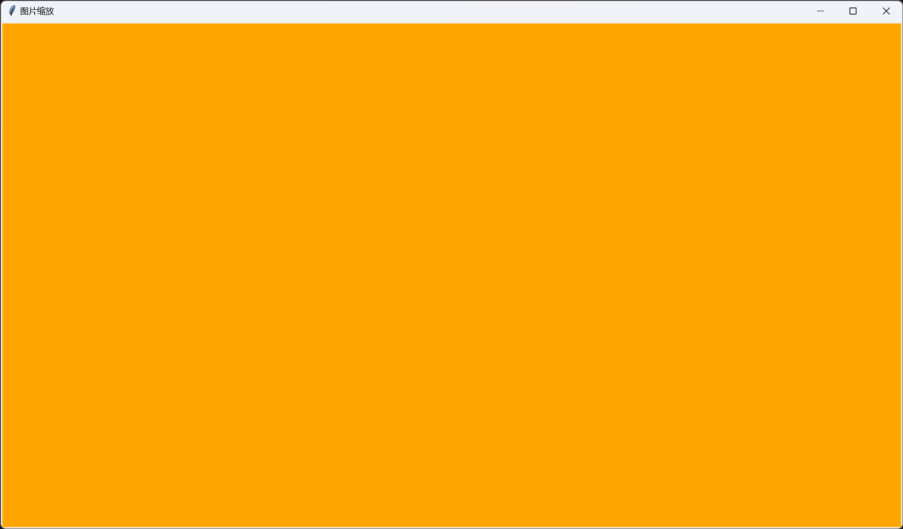

§5.1 静态图片
============

一、png 图片
-----------

`tkintertools` 的 `PhotoImage` 是继承自 `tkinter` 的 `PhotoImage` 类的，因此 `tkinter.PhotoImage` 的功能基本上都是可以使用的，为什么是基本上呢？因为有一些方法被重载了。后面会详细讲到。

### 1.1 支持的图片文件

目前支持的图片类型仍然和 `tkinter.PhotoImage` 保持一致，一般是指 png 和 gif。虽然是这样，但是 `tkintertools.PhotoImage` 仍然提供了更多的功能。

### 1.2 图片缩放

以前我们在编写 `tkinter` 时常常会配合 `PIL` 库一起使用，因为 `tkinter.PhotoImage` 无法缩放图片，但是事实并非如此。`tkinter.PhotoImage` 实际上也是可以进行缩放的，只不过自带的方法只能进行整数倍缩放。放大是方法 `PhotoImage.zoom`，缩小是 `PhotoImage.subsample`。无法进行特殊倍数的缩放属实可惜了。

而 `tkintertools` 则很好地解决了这个问题，我们可以将 `tkintertools.PhotoImage` 缩放为任意大小，不过这个过程比较消耗计算机性能，当然，`tkintertools` 也会尝试调用 `PIL` 库来提高性能，前提是你得有 `PIL` 库。如果你没有 `PIL`，`tkintertools` 也是可以正常缩放图片的，只不过性能上就不好说了。

!!! info "注意"
    图片缩放只适用于 png 类型的图片。

`tkintertools.PhotoImage` 使用方法 `zoom` 来缩放图片，可以放大和缩小，参数是宽高的缩放比例，返回一个新的 `tkinter.PhotoImage` 对象。一般来说我们不需要主动去调用这个方法，因为 `tkintertools` 底层会自动调用这个方法来让图片自动缩放以适应窗口（画布）的宽高。

下面是一个简单的例子：

```python
import tkintertools as tkt

root = tkt.Tk('图片缩放', 1600, 900)
canvas = tkt.Canvas(root, 1600, 900, 0, 0, bg='orange')  # 背景色改为橙色，方便区分
canvas.create_image(900, 450, image=tkt.PhotoImage('example.png'))
root.mainloop()
```

你可以试着拖拽窗口来改变窗口大小，看看图片大小是否会跟着改变。

### 1.3 全局化的图片变量

这其实是 `tkinter` 中一个让我们头疼事情。如果你将 1.2 中的代码改为 `tkinter` 的样子，就像下面这样，你会发现，根本没有图片被显示出来。

```python
import tkinter as tk

root = tk.Tk()
root.title('图片缩放')
root.geometry('1280x720')
canvas = tk.Canvas(bg='orange')
canvas.place(width=1280, height=720)

canvas.create_image(640, 360, image=tk.PhotoImage('example.png'))

root.mainloop()
```

下面是运行效果：



但是，如果你将 `tkinter.PhotoImage` 换成 `tkintertools.PhotoImage`，就像下面这样，你会发现居然没问题了！当然，对应的容器控件也要替换。

```diff
    import tkinter as tk

+   import tkintertools as tkt

-   root = tk.Tk()
+   root = tkt.Tk()
    root.title('图片缩放')
    root.geometry('1280x720')
-   canvas = tk.Canvas(bg='orange')
+   canvas = tkt.Canvas(root, 1280, 720, bg='orange')
    canvas.place(width=1280, height=720)

-   canvas.create_image(640, 360, image=tk.PhotoImage('example.png'))
+   canvas.create_image(640, 360, image=tkt.PhotoImage('example.png'))

    root.mainloop()
```

这难道是 `tkinter` 的 bug 吗？这倒不是，只不过 `tkinter` 有个机制非常坑而已，简单说就是，如果你的图片变量不是全局变量，那么这个变量的数据就会被 Python 垃圾收集器给干掉了……（~~寄~~）但是 `tkintertools` 很好的解决了这个问题（不算 bug，只能算是一个问题）。怎么解决的？自己看源码去……（~~坏笑~~）

二、gif 图片
-----------

我们知道，gif 图片是动图图片，`tkinter.PhotoImage` 也支持 gif 图片，但在实际使用时，它只会展示其第一帧的画面，这并不是我们想要的结果，关于这一问题，`tkintertools` 给出了一个较为合适的解决方案，将在下一节中详细的讲述。不过这里要注意一点，`tkintertools.PhotoImage` 在没有调用相关功能时，如果直接显示 gif 图片，会出现报错的问题，因为你没有对其进行解析。这也将在下一节中进行讲述。此部分主要是说明，`tkintertools.PhotoImage` 无法将 gif 作为静态图片进行展示。

