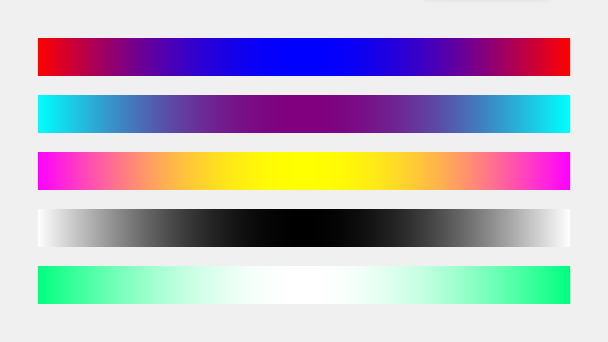

# §6.1 颜色效果

## 一、自定义控件的颜色

### 1.1 颜色字符串

我们一般用颜色字符串来表示一个颜色，格式有两种。

其一，就是简单粗暴的颜色英文名称，如 `"red"`、`"green"` 和 `"blue"` 等，但并不是所有的颜色都可以被识别，主要是指 CSS 中所用的颜色字符串。这种方式比较简单明了，可以很清楚这种颜色的效果，但是并不够精细，如果想要精确地展示某一颜色，必须要用到 RGB 颜色码。

RGB 颜色码就是第二种格式。R 表示 Red，意为红色程度，G 表示 Green，意为绿色程度，B 表示 Blue，意为蓝色程度。它们的程度都用 16 进制的数字来表示，位数一般为 1~4 皆可，常用的是 1 位和 2 位的。比如 `"#FFF"` 表示 1 位的，`"#000000"` 表示 2 位的。这些颜色字符串前面都加了一个符号 “#” 来表示它是一个 RGB 格式的颜色码。关于颜色程度，0 为最小，F 为最大，0~F 依次增大。

!!! question "扩展：为什么用红绿蓝表示颜色？"

    这是因为电子屏幕基本上都是用红色、绿色和蓝色来显示颜色的，当他们的占比不同，显示的颜色就不同。不信你可以拿放大镜仔细看电子屏幕，你会发现它们实际都是红色、绿色和蓝色，并没有其他的颜色。

### 1.2 透明

由于 `tkintertools` 所使用最主要的容器控件是 `Canvas`，而 `Canvas` 的颜色机制与其他控件略有不同。要说具体区别，那就是如果颜色为空，则在 `Canvas` 中表现为不绘制对应的颜色块（体现为完全透明），而不是报错。

透明对应到颜色字符串上，就是一个空字符串 —— `""`（注意：不是空格字符串，是空字符串）。

### 1.3 自定义控件的颜色

在讲解给控件自定义颜色之前，我们有必要知道，一个控件的一般组成。一个控件，一般由三个部分组成：外框、内块和文本。当然，这是一般的控件，更加复杂的控件或者非常简单的控件可能并不是这个样子。

`tkintertools` 的控件一般在实例化的时候会给定几个颜色参数，一般分别是：

-   `color_fill`: 内块的颜色元组
-   `color_outline`: 外框的颜色元组
-   `color_text`: 文本的颜色元组

有部分控件可能并没有完整的上述三个参数，比如 `Switch` 就没有 `color_text`，因为它根本就没有文本部分。

我们可以注意到，上述参数的值都是颜色元组，并非颜色字符串，实际上，这里的颜色元组属于 tkintertools 制定的一种格式，一般是这样的：

```python
(控件正常时的颜色, 控件被触碰时的颜色, 控件交互时的颜色, 控件被禁用时的颜色)
```

-   控件正常时的颜色: 一般情况下的颜色
-   控件被触碰时的颜色: 鼠标悬停于控件上时的颜色
-   控件交互时的颜色: 控件被点击等事件被触发时的颜色
-   控件被禁用时的颜色: 控件被禁用后显示的颜色

只能多，不能少，不然在调用相关的方法时会报错导致对应功能无法执行（但不会引起整个程序崩溃）。当然也并不一定是元组，只要是一个对应格式的序列即可，比如列表等。

现在你应该知道 [§1.2 认识 tkintertools](./1-2.md) 中第 1 张和第 2 张图中大部分控件是怎么做出来的吧？源代码在图片下面，去看看吧！

## 二、创建颜色丰富的控件或画面

`tkintertools` 的颜色处理是完全交给函数 `color` 的。`tkintertools.color` 非常强大，能快速获得大量渐变色、对比色等。

### 2.1 获取对比色

我们通过 color 函数获取一个颜色的对比色。下面是一个简单示例：

```python
print(tkt.color("red"))  # "#00FFFF"
```

当 `tkintertools.color` 只有一个参数的时候，将返回该参数的对比色。

### 2.2 获取渐变色

实际获取渐变色并非 `tkintertools.color` 的主要功能，函数 `color` 有几个参数，可见 [函数 color 的文档](../documents/main.md#03-color)。不难知道，`color` 的主要功能是得到一个颜色字符串按比例到目标颜色字符串的结果。当这个比例为 1 的时候，返回值就是目标颜色字符串，而目标颜色字符串的默认值是对比色，默认比例也是 1，因此当没有其他参数的时候，返回值就是对比色（见上面 [2.1 获取对比色](#21-获取对比色)）。

当这个比例是慢慢变化的，我们就可以得到渐变色的效果了。当然，我们不应该通过循环来获取每一个比例的颜色，毕竟颜色字符串转换成 RGB 颜色码是需要花费一定时间的，如果直接手动循环得到渐变色，那么将十分消耗性能，我们应该通过参数 `seqlength` 来得到一系列渐变色。下面是一个简单的示例：

```python
import tkintertools as tkt

root = tkt.Tk("渐变色", 1600, 900)
canvas = tkt.Canvas(root, 1600, 900, 0, 0)

color_tup_lst = [
    ("red", "blue"),
    ("#00FFFF", "purple"),
    ("#FF00FF", "#FFFF00"),
    ("white", "black"),
    ("springgreen", "#FFF")
]

for i, color_tup in enumerate(color_tup_lst):
    for j, c in enumerate(tkt.color(color_tup, seqlength=1400)):
        x = j + 100
        y = i*150 + 100
        canvas.create_line(x, y, x, y + 100, fill=c, width=2)

root.mainloop()
```

下面是实现的效果图：


### 2.3 自定义渐变规则

上面的这一系列颜色之间的 RGB 码是等差的，我们也可以设置非等差的，来得到一些不同的效果（比如让它们的渐变规则为正弦函数）。

下面我们通过设置 `color` 函数的参数 `controller`，来实现自定义的渐变规则，此处以正弦函数的区间 [0, π] 为例。参数 `controller` 是一个元组（列表也行），其格式如下：

```python
(控制函数, 区间起始值, 区间终止值)
```

!!! warning "警告"

    控制器参数不是任意函数都可以的！函数在指定区间内的区域内必须为非负值，否则在计算过程中会得到负数的 RGB 码，这是不正确的。

```python
import math

import tkintertools as tkt

root = tkt.Tk("自定义的渐变色", 1600, 900)
canvas = tkt.Canvas(root, 1600, 900, 0, 0)

color_tup_lst = [
    ("red", "blue"),
    ("#00FFFF", "purple"),
    ("#FF00FF", "#FFFF00"),
    ("white", "black"),
    ("springgreen", "#FFF")
]

for i, color_tup in enumerate(color_tup_lst):
    color_lst = tkt.color(color_tup, seqlength=1400, controller=(lambda x: abs(math.sin(x)), 0, math.pi))
    for j, c in enumerate(color_lst):
        x = j + 100
        y = i*150 + 100
        canvas.create_line(x, y, x, y + 100, fill=c, width=2)

root.mainloop()
```

下面是实现的效果图：



和之前的那一张图相比，你发现了什么不同吗？实际上，第一张图也是有控制函数的，只不过它的函数为单位正比例函数 y = x 区间 [0, 1] 部分。
