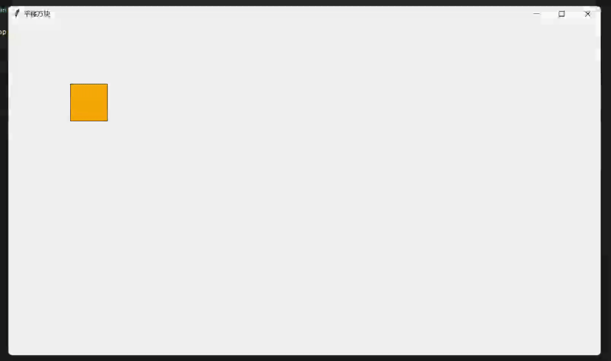
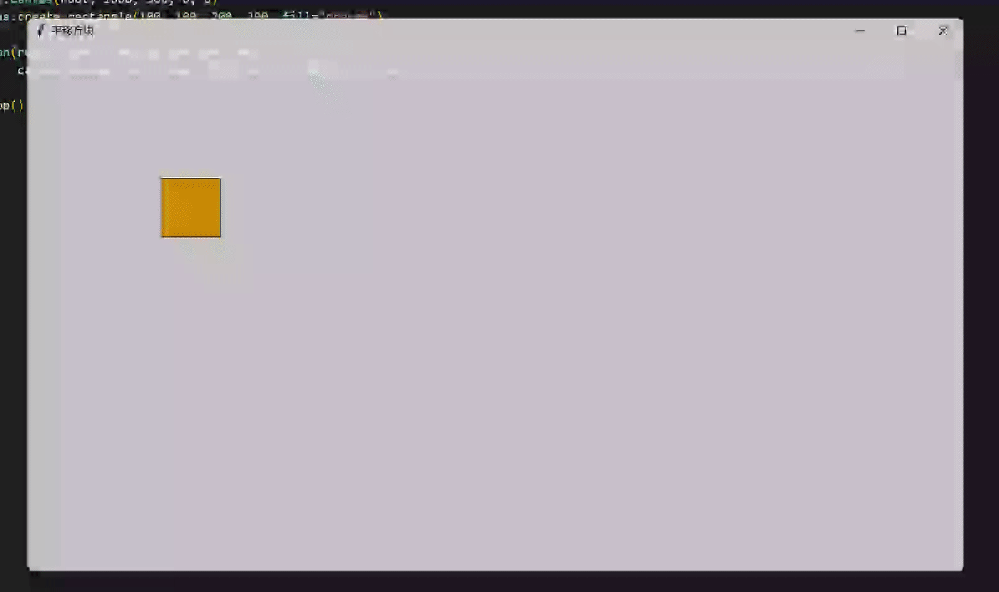

§6.2 动画制作
============

`tkintertools` 中的大部分动画都是用动画类 `Animation` 实现的。`Animation` 的文档见 [01. Animation](../documents/main.md#01-animation)。

一、简单动画
-----------

### 1.1 移动一个简单的方块

我们可以通过 Animation 来平移一个简单的方块，下面是一个简单的示例：

```python
import tkintertools as tkt

root = tkt.Tk("平移方块", 1600, 900)
canvas = tkt.Canvas(root, 1600, 900, 0, 0)
rect = canvas.create_rectangle(100, 100, 200, 200, fill="orange")

tkt.Animation(rect, 1000, translation=(500, 500), canvas=canvas).run()

root.mainloop()
```

下面是效果图：



### 1.2 按规则移动一个方块

如果只是像上面那样移动一个方块，缺少了些许韵味，我们可以自定义一个方块运行的控制函数，来使它按照我们的意思来运动：

```python
import math

import tkintertools as tkt

root = tkt.Tk("平移方块", 1600, 900)
canvas = tkt.Canvas(root, 1600, 900, 0, 0)
rect = canvas.create_rectangle(100, 100, 200, 200, fill="orange")

tkt.Animation(rect, 1000, translation=(500, 500),
              canvas=canvas, controller=(math.sin, 0, math.pi)).run()

root.mainloop()
```

下面是效果图：



### 1.3 移动其他东西

当然，我们不只是能移动一个简单方块，我们还可以利用 Animation 来移动控件！

```python
import math

import tkintertools as tkt

root = tkt.Tk("平移方块", 1600, 900)
canvas = tkt.Canvas(root, 1600, 900, 0, 0)
button = tkt.Button(canvas, 100, 100, 200, 50, text='按钮')

tkt.Animation(button, 2000, translation=(500, 500),
              controller=(math.sin, 0, math.pi / 2), fps=90).run()

root.mainloop()
```

当然，这对 tkinter 的原生控件也是支持的！

```python
import math
import tkinter

import tkintertools as tkt

root = tkt.Tk("平移方块", 1600, 900)

button = tkinter.Button(root, text='原生按钮')

button.place(width=200, height=50, x=100, y=100)

tkt.Animation(button, 2000, translation=(500, 500),
              controller=(math.sin, 0, math.pi / 2), fps=90).run()

root.mainloop()
```

效果图就不放了哈，自己可以试试。

二、组合动画
-----------

### 2.1 多个动画

一个动画只能控制一个方向上的运动，如果要在多个方向上同时进行运动，那么就需要同时实例化多个动画类。

下面我们通过两个动画类来分别控制水平方向和竖直方向上的运动，以此实现一个类似正弦函数轨迹的运动。

```python
import math

import tkintertools as tkt

root = tkt.Tk('Animation', 1600, 900)
canvas = tkt.Canvas(root, 1600, 900, 0, 0)

item = canvas.create_oval(100-50, 450-50, 100+50, 450+50, fill='pink')
tkt.Animation(item, 1000, translation=(300, 0),
              canvas=canvas, loop=True, fps=90).run()
tkt.Animation(item, 1000, translation=(0, 300), canvas=canvas,
              loop=True, controller=(math.sin, 0, math.tau), fps=90).run()

root.mainloop()
```
下面是效果图：


### 2.2 延时动画

延时动画实际就是手动给 `Animation` 的启动加个延时。我们可以通过 `tkinter` 模块自带的 `after` 方法来做到这一点。

```python
tkinter.Widget.after(延迟毫秒, 关联函数, 关联函数的各个参数...)
```

上面的 `tkinter.Widget` 可以是任意的容器控件。

### 2.3 自定义动画函数

当然，还有其他很多动画，`Animation` 并不直接提供，但它提供一个 API 可以让我们使用它里面的动画生成方法。相比上面大家也已经看到了，用 `math` 库里的 `sin` 函数可以得到 `sin` 函数轨迹的运动效果。但其实，我们不一定要用已有的函数，我们也可也自定义一些函数来满足我们的需求。比如说分段函数等。此外，感兴趣的读者可以试一下，如何实现一个圆的动画，当然，是一个循环的动画，而不是一次动画。

这里自定义函数用到的 API 就是 `Animation` 的初始化参数 `controller`。在前面小节中的 `color` 函数里，我们就已经接触过了，它们的本质实际都是一样的。但是，`color` 函数对控制函数及其上下界是有要求的，因为通过上下界中的值带入到控制函数求得的值不能是负数，毕竟 `color` 函数通过控制函数计算的是比例，必须是非负值。一旦计算得到负数，就会触发报错。

三、高级动画
-----------

### 3.1 原生动画

本节开头就说了，`tkintertools` 的大部分动画是通过 `Animation` 实现的，那也就意味着，还有一小部分不是通过 `Animation` 做的。而这不是用 `Animation` 来做的就是通过 `tkinter` 模块最基本的功能来实现的，也被（我）称之为原生动画。

原生动画基本都是配合控件的 `after` 方法来做的，`after` 可以产生时延，而控件的移动可以产生运动，两者结合就是动画了。由于控件的移动不是慢慢移动的，而是瞬移的，所以我们需要在每一小段时间里移动一点点，多次移动积累就成了动画。

下面给一个简单的示例：

```python
import tkintertools as tkt

root = tkt.Tk('原生动画', 1600, 900)
canvas = tkt.Canvas(root, 1600, 900, 0, 0)

button = tkt.Button(canvas, 100, 100, 200, 50, text='按钮')


def animate() -> None:
    """移动动画"""
    button.move(5, 0)
    canvas.after(30, animate)


animate()
root.mainloop()
```

下一部分的 3D 动画就基本是用原生动画实现的，用原生动画的话，会更加复杂一些，但也就不会被 `Animation` 给局限住，毕竟 `Animation` 不是万能的。

### 3.2 3D 动画

此部分需配合 3D 部分食用，请见 [7.3 3D 动画](./7-3.md)
