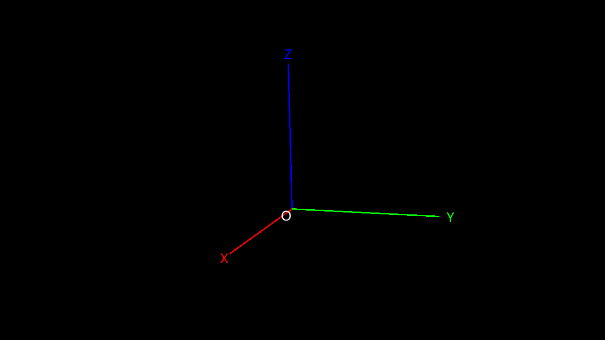
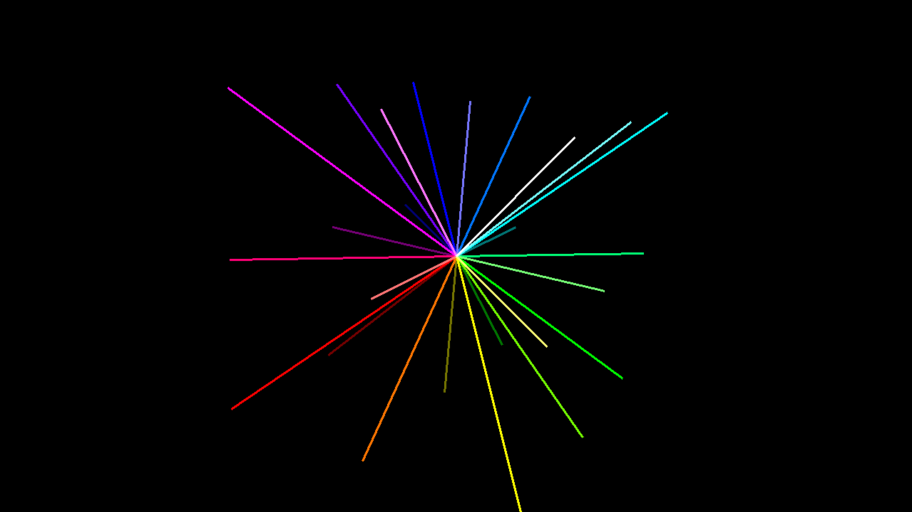
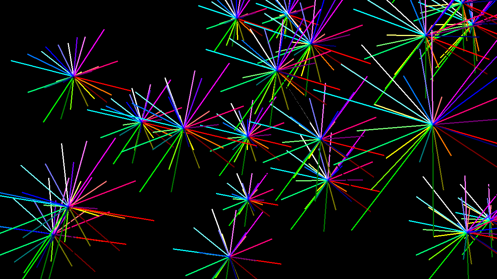
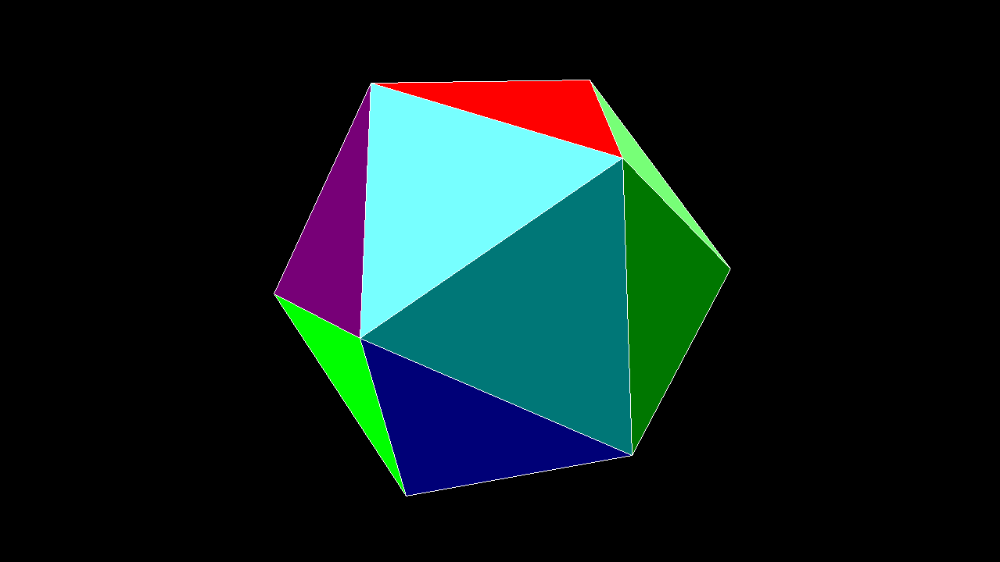
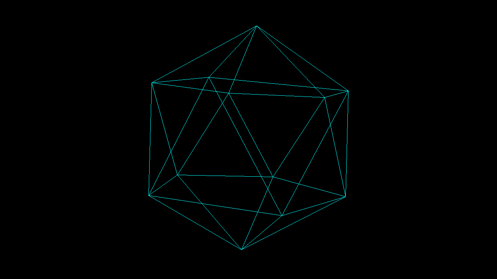
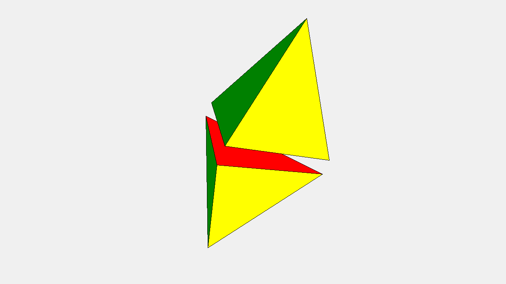

3D 对象
=======

一、3D 对象的容器控件
-------------------

`tkintertools` 的 3D 画布不是只有一个，它实际的继承关系是下面这样的：

`tkinter.Canvas` -> `tkintertools.Canvas` -> `tools_3d.Canvas3D` -> `tools_3d.Space`

其中，后面两个是属于 `tkintertools` 的子模块 `tools_3d` 里面的。

### 1.1 Space 类

内置的 `Space` 类已经帮我们绑定好了相关的操作方法，如鼠标右键拖动就是平移（`translate`）、鼠标左键拖动就是旋转（`rotate`）以及鼠标滚轮滚动就是缩放（`scale`），一般用于查看 3D 对象的外观。

### 1.2 Canvas3D 类

`Canvas3D` 属于是什么 3D 事件都没有绑定的一个容器控件了。它存在的目的就是让使用者可以自定义绑定的事件及绑定的函数，而不是强制使用某些按键来触发某些事件（如鼠标左键拖动旋转 3D 对象）。这里要说明一点的就是，由于 `tkinter` 模块制定绑定事件时，会把之前已经绑定的同类事件给覆盖掉，因此我们在自定义绑定事件的时候，不能把之前的给丢掉了，要在新的绑定事件中加上它们，此外，多个绑定事件之间的执行顺序非常重要，有时候顺序错误会导致不可估计的后果。

`Canvas3D` 类有一个名为 `space_sort` 方法非常关键，在每次画面改动之后都必须调用它来更新，否则画面不会有任何的变化。比如每一次平移、每一次旋转和缩放等，都需要调用一下它来更新一下画面。“space sort” 意为“空间位置排序”，也就是说，每次调用它后，它会根据每个 3D 对象的数据来得出它们的前后位置关系（尽管不精确，后面会再次提到），计算出前后关系再根据前后位置关系来更新画面。

不过 `Space` 类中已经帮我们内置好了这个方法的调用，因此 `Space` 相比于 `Canvas3D` 来说非常方便。不过有时候我们并不想让用户能够拖动画面，我们可能只是想展示某一 3D 动画或者画面，这时 `Canvas3D` 就派上用场了！因为它根本就没有对应事件的绑定！

!!! info "注意"
    尽管 `Space` 如此方便了，但是无论是 `Space` 还是 `Canvas3D`，在新增加一个 3D 对象的时候，都应该调用一下 `space_sort` 方法来更新画面，因为考虑到性能和某些特殊要求的情况下，这个时候 `space_sort` 方法并不会被自动调用。

### 1.3 3D 容器控件的坐标规划

3D 容器控件采用的都是右手系，原点位于画布中央，下图清晰地展示了 3D 容器中的空间坐标系：



上图中，X、Y 和 Z 分别表示直角空间坐标系的三个轴，O 表示原点。画布的默认视角都是正对着 X 轴正方向的，当然，这里我为了展示清楚，将整体平移和旋转了一下，所以原点并不在画布中央，视角也不是正对着 X 轴正方向的。

### 1.4 3D 容器控件上的 UI 控件

尽管 3D 对象的基准在画布中央，但是这并不会影响 UI 控件的布局。和其他画布一样，UI 控件仍是以左上角为基准，反平面坐标系（y 轴反向）。

!!! tip "提示"
    无论怎样布局，UI 控件总是在 3D 对象的上方，也就是说，3D 对象不会遮挡 UI 控件。

二、创建基本的 3D 对象
--------------------

基本的 3D 对象包括点（`Point`）、线（`Line`）和面（`Side`），后面还会讲到几种稍微复杂的 3D 对象，如长方体等。

为了方便演示效果，下面的代码都将采用 `Space` 作为容器控件来完成。

### 2.1 点

我们通过类 `Point` 来显示一个点，具体的参数可以去文档中查看。下面的代码我们绘制了多个点。

!!! info "注意"
    点本身是没有大小的，但是这里我们为了显示出它，给了它一个虚拟的大小，但是这个大小并不会随着这个点在视觉上的远近而缩放，因为一旦进行缩放，那就是不是点，而是球了。  
    点的大小只是方便我们观察它而设定的，你可以根据你的喜好或者需要，设定它显示出来的大小。

下面只是随机地在一些位置绘制了一个点，总体上表现为一个球：


<details><summary><b>源代码</b></summary>

```python
import math
import random

import tkintertools as tkt
from tkintertools import tools_3d as t3d

root = tkt.Tk('Point', 1280, 720)
space = t3d.Space(root, 1280, 720, 0, 0, bg='black', keep=False)

for _ in range(10000):
    x = random.randint(-1000, 1000)
    y = random.randint(-1000, 1000)
    z = random.randint(-1000, 1000)
    c = random.randint(0, 256 ** 3 - 1)
    if math.hypot(x, y, z) <= 400:  # 只要半径 400 以内的
        t3d.Point(space, (x, y, z), size=3, fill=f'#{c:06X}', outline='grey')

space.space_sort()
root.mainloop()
```

</details>

或者我们可以让它们变得有规律些（应该看得出来是个正方体的样子）：


<details><summary><b>源代码</b></summary>

```python
import tkintertools as tkt
from tkintertools import tools_3d as t3d

root = tkt.Tk('Point', 1280, 720)
space = t3d.Space(root, 1280, 720, 0, 0, bg='black', keep=False)

for x, r in zip([-300, -100, 100, 300], ['00', '55', 'AA', 'FF']):
    for y, g in zip([-300, -100, 100, 300], ['00', '55', 'AA', 'FF']):
        for z, b in zip([-300, -100, 100, 300], ['00', '55', 'AA', 'FF']):
            t3d.Point(space, [x, y, z], fill=(fill := f'#{r}{g}{b}'), size=5, outline='grey')

space.space_sort()
root.mainloop()
```

</details>

### 2.2 线

我们通过类 `Line` 来显示一条有限长直线，具体参数参考文档。

下面是一个十分简单的示例：



<details><summary><b>源代码</b></summary>

```python
import tkintertools as tkt
from tkintertools import tools_3d as t3d

root = tkt.Tk('Line', 1280, 720)
space = t3d.Space(root, 1280, 720, 0, 0, bg='black', keep=False)

for x, r in zip([-100, 0, 100], ['00', '77', 'FF']):
    for y, g in zip([-100, 0, 100], ['00', '77', 'FF']):
        for z, b in zip([-100, 0, 100], ['00', '77', 'FF']):
            t3d.Line(space, [0, 0, 0], [x, y, z], fill=f'#{r}{g}{b}', width=3)

space.space_sort()
root.mainloop()
```

</details>

或许我们可以再玩点更高级的？



怎么样？是不是非常酷炫呢？

<details><summary><b>源代码</b></summary>

```python
import random

import tkintertools as tkt
from tkintertools import tools_3d as t3d

root = tkt.Tk('Line', 1280, 720)
space = t3d.Space(root, 1280, 720, 0, 0, bg='black', keep=False)


def flower(x, y, z, k):  # type: (int, int, int, int) -> None
    """绘制线条花"""
    for dx, r in zip([-k, 0, k], ['00', '77', 'FF']):
        for dy, g in zip([-k, 0, k], ['00', '77', 'FF']):
            for dz, b in zip([-k, 0, k], ['00', '77', 'FF']):
                t3d.Line(space, (x, y, z), (x + dx, y + dy, z + dz), fill=f'#{r}{g}{b}', width=3)


for _ in range(25):
    x = random.randint(-500, 500)
    y = random.randint(-500, 500)
    z = random.randint(-500, 500)
    k = random.randint(50, 100)  # 线条最大长度
    flower(x, y, z, k)

space.space_sort()
root.mainloop()
```

</details>

### 2.3 面

我们通过类 `Side` 来显示一个有限面积直边平面，具体参数参考文档。

下面简单用面来绘制一个正二十面体：



<details><summary><b>源代码</b></summary>

```python
import itertools
import math
import statistics

import tkintertools as tkt
from tkintertools import tools_3d as t3d

root = tkt.Tk('Side', 1280, 720)
space = t3d.Space(root, 1280, 720, 0, 0, bg='black', keep=False)

m = 200 * math.sqrt(50 - 10 * math.sqrt(5)) / 10
n = 200 * math.sqrt(50 + 10 * math.sqrt(5)) / 10
points = []
dis_side = 200 * (3 * math.sqrt(3) + math.sqrt(15)) / 12 / ((math.sqrt(10 + 2 * math.sqrt(5))) / 4)  # 面到中心的距离
count, color_lst = 0, ['00', '77', 'FF']
color = [f'#{r}{g}{b}' for r in color_lst for g in color_lst for b in color_lst]

for i in m, -m:
    for j in n, -n:
        points.append([0, j, i])
        points.append([i, 0, j])
        points.append([j, i, 0])

for p in itertools.combinations(points, 3):  # 所有的顶点组合
    dis = math.hypot(*[statistics.mean(c[i] for c in p) for i in range(3)])
    if math.isclose(dis, dis_side):
        t3d.Side(space, *p, fill=color[count], outline='white')
        count += 1

space.space_sort()
root.mainloop()
```

</details>

面其实也可以玩出很多花样，比如，让它内部透明，只让其边框线条有颜色，这样或许我们可以得到这样的效果：



是不是看着挺有科技感的？在学了后面的章节“3D 动画”之后，让它动起来就更有内味儿了！

<details><summary><b>源代码</b></summary>

```python
import itertools
import math
import statistics

import tkintertools as tkt
from tkintertools import tools_3d as t3d

root = tkt.Tk('Side', 1280, 720)
space = t3d.Space(root, 1280, 720, 0, 0, bg='black', keep=False)

m = 200 * math.sqrt(50 - 10 * math.sqrt(5)) / 10
n = 200 * math.sqrt(50 + 10 * math.sqrt(5)) / 10
points = []
dis_side = 200 * (3 * math.sqrt(3) + math.sqrt(15)) / 12 / ((math.sqrt(10 + 2 * math.sqrt(5))) / 4)  # 面到中心的距离

for i in m, -m:
    for j in n, -n:
        points.append([0, j, i])
        points.append([i, 0, j])
        points.append([j, i, 0])

for p in itertools.combinations(points, 3):  # 所有的顶点组合
    dis = math.hypot(*[statistics.mean(c[i] for c in p) for i in range(3)])
    if math.isclose(dis, dis_side):
        t3d.Side(space, *p, fill='', outline='cyan')

space.space_sort()
root.mainloop()
```

</details>

!!! warning "警告"
    目前由于技术原因，实际过程中不建议给面的内部上色，当两个面的距离比较近时，这两个面可能出现前后位置关系显示颠倒的问题！尚无比较好的解决办法！对于后面的复杂 3D 对象（即几何体）也是如此。  
    目前前后位置的确定是通过欧几里得距离计算得到的，在两个面之间有一定距离时才能正确显示其前后位置关系。

三、创建复杂的 3D 对象
--------------------

复杂的 3D 对象是指非基本的对象，如长方体（`Cuboid`）、四面体（`Tetrahedron`）等复杂的几何体，当然，你也可以直接用基本的 3D 对象将它们模仿出来，但这并不是封装好的，它们并非一个整体，直接使用 `Geometry` 及其子类是更加推荐的选择。

### 3.1 长方体

我们可以直接使用 `Cuboid` 来创建一个长方体，具体参数见文档。

下面利用长方体简单地绘制一个魔方，这里放一张白色背景的图（~~防止你认为只有黑色背景~~）。


<details><summary><b>源代码</b></summary>

```python
import tkintertools as tkt
from tkintertools import tools_3d as t3d

root = tkt.Tk('Cuboid', 1280, 720)
space = t3d.Space(root, 1280, 720, 0, 0, keep=False)

for a in -100, 0, 100:
    for b in -100, 0, 100:
        for c in -100, 0, 100:
            t3d.Cuboid(space, a - 50, b - 50, c - 50, 100, 100, 100,
                       color_fill_up='white', color_fill_down='yellow', color_fill_left='red',
                       color_fill_right='orange', color_fill_front='blue', color_fill_back='green')

space.space_sort()
root.mainloop()
```

</details>

当我们将长方体也设为透明，再加上前一章所学的渐变色，就可以得到像下面这样的效果：


<details><summary><b>源代码</b></summary>

```python
import tkintertools as tkt
from tkintertools import tools_3d as t3d

root = tkt.Tk('Cuboid', 1280, 720)
space = t3d.Space(root, 1280, 720, 0, 0, bg='black', keep=False)

for l, c in zip(range(10, 300 + 1, 10), tkt.color(['white', 'black'], seqlength=30)):
    s = l << 1
    t3d.Cuboid(space, -l, -l, -l, s, s, s,
               color_outline_back=c, color_outline_down=c, color_outline_front=c,
               color_outline_left=c, color_outline_right=c, color_outline_up=c)

space.space_sort()
root.mainloop()
```

</details>

### 3.2 四面体

同上，我们也可以用 `Tetrahedron` 直接创建四面体，具体参数见文档。

这里就不炫了，搞个简单点的完事儿！



<details><summary><b>源代码</b></summary>

```python
import math

import tkintertools as tkt
from tkintertools import tools_3d as t3d

root = tkt.Tk('Tetrahedron', 1280, 720)
space = t3d.Space(root, 1280, 720, 0, 0, keep=False)

t3d.Tetrahedron(space, [-100, 0, 0 + 10], [50, 50 * math.sqrt(3), 0 + 10], [50, -50 * math.sqrt(
    3), 0 + 10], [0, 0, 100 * math.sqrt(2) + 10], color_fill=['red', 'yellow', 'blue', 'green'])
t3d.Tetrahedron(space, [-100, 0, 0 - 10], [50, 50 * math.sqrt(3), 0 - 10], [50, -50 * math.sqrt(
    3), 0 - 10], [0, 0, -100 * math.sqrt(2) - 10], color_fill=['red', 'yellow', 'blue', 'green'])

space.space_sort()
root.mainloop()
```

</details>

### 3.3 任意凸面几何体

除了上面提到的两种，实际我们可以通过 `Geometry` 创建任意的（凸面）多面体。但这里要注意的是，凹面几何体也是可以创建的，不过目前不保证凹面几何体完全没问题，因此需慎用凹面几何体。

本质上，`Geometry` 的背后都是 `Side`，它只不过是将其进行了一个组合和封装，因此我们就是通过多个 `Side` 类创建它的，此外，我们在创建了它之后，还可以用它的 `append` 方法向其继续添加 `Side`。
