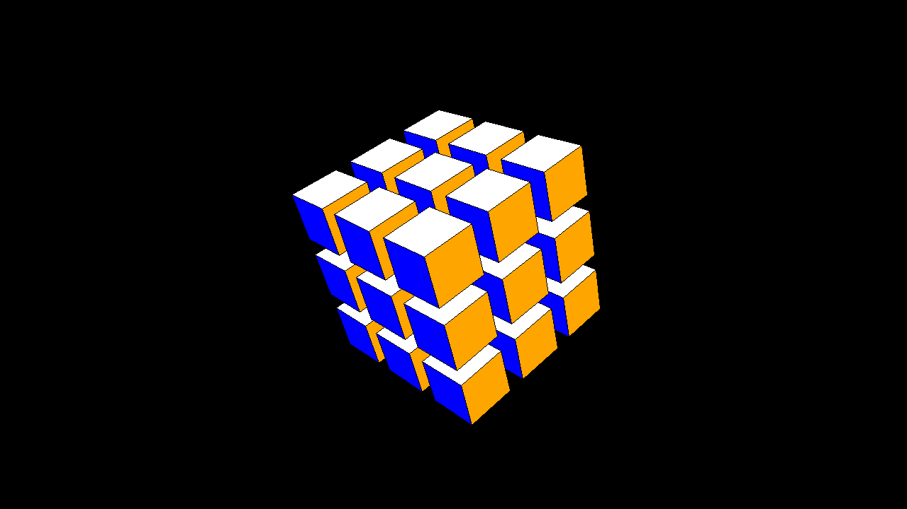

§7.4 3D 进阶
============

一、自定义 3D 画布
-----------------

### 1.1 绑定事件

每个 3D 对象都有三个基本的功能，分别为平移（`translate`）、旋转（`rotate`）和缩放（`scale`），使用者可以根据自身需要，自定义绑定事件并调用相关的方法。比如说，我们现在想做这样一个绑定：按下等号键和减号键可以使每个 3D 对象自身的大小进行缩放，那么就可以按下面的步骤做。

分析：使 3D 对象自身大小进行缩放需要调用方法 `scale`，且缩放中心就是每个 3D 对象自身的几何中心，参数 `center` 值为 `None`，也就是默认值的时候，它会按自身的几何中心进行缩放。这里可以使用 `Canvas3D` 作为容器控件，也可以使用 `Space`，这并不会影响到这个功能的实现。



<details><summary><b>源代码</b></summary>

```python
import tkintertools as tkt
from tkintertools import tools_3d as t3d

root = tkt.Tk('Bind Event', 1280, 720)
space = t3d.Space(root, 1280, 720, 0, 0, bg='black')

for a in -100, 0, 100:
    for b in -100, 0, 100:
        for c in -100, 0, 100:
            t3d.Cuboid(space, a - 50, b - 50, c - 50, 100, 100, 100,  # 创建正方体
                       color_fill_up='white', color_fill_down='yellow', color_fill_left='red',
                       color_fill_right='orange', color_fill_front='blue', color_fill_back='green')
space.space_sort()


def scale(event):
    """ 缩放事件 """
    k = 1.05 if event.keysym == 'equal' else 0.95 if event.keysym == 'minus' else 1  # 缩放比率
    for geo in space.geos():
        geo.scale(k, k, k)
        geo.update()
    space.space_sort()


root.bind('<Key-equal>', scale)  # 绑定等号按键
root.bind('<Key-minus>', scale)  # 绑定减号按键
root.mainloop()
```

</details>

实际上，[§1.2 认识 tkintertools](./1-2.md#21-高度可配置的控件) 中就有一张和这个类似的图片。

### 1.2 注意事项

上文提到，使用 `Space` 也可以，不会有任何影响，但我们在前面了解到，`Sapce` 实现了一些内置功能，比如旋转，这些内置功能是通过绑定事件来实现的，而 `tkinter` 中绑定事件一般是会覆盖前面的，上面为什么可以呢？

其实，`Space` 确实绑定了一些事件，但是并没有涉及到按键 + 和 -，因此没有上面影响，但这并不代表所有的事件都没有影响，在使用 `Space` 的时候，我们尽量要避开那些绑定的事件，如果确实需要绑定新的事件，但又不想覆盖掉旧的的事件，那么在绑定新事件的时候，你应该将参数 `add` 设为 `'+'`。

!!! tip "提示"
    此处不要把 `add` 参数的值和前面的绑定加号事件混淆了，`'+'` 表示新事件的绑定是附加的，而非原来的覆盖。

比如像下面这样：

```python
space.bind('<B1-Motion>', function, add='+')
```
