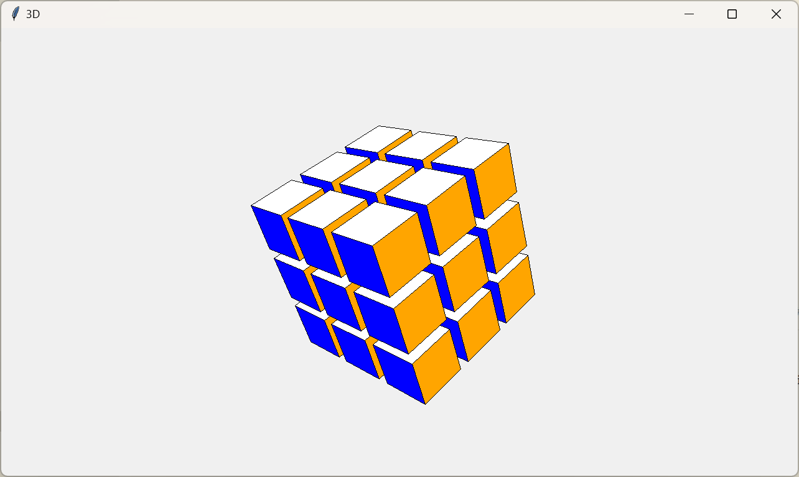

§1.2 认识 tkintertools
======================

- [§1.2 认识 tkintertools](#12-认识-tkintertools)
  - [一、基本介绍](#一基本介绍)
    - [1.1 基本原理](#11-基本原理)
    - [1.2 模块优点](#12-模块优点)
    - [1.3 模块缺点](#13-模块缺点)
  - [二、特色功能](#二特色功能)
    - [2.1 高度可配置的控件](#21-高度可配置的控件)
    - [2.2 自动控制大小](#22-自动控制大小)
    - [2.3 高清显示](#23-高清显示)
    - [2.4 简单的动画效果](#24-简单的动画效果)
    - [2.5 渐变色](#25-渐变色)
    - [2.6 详细的类型提示](#26-详细的类型提示)
    - [2.7 跨平台](#27-跨平台)
    - [2.8 简单 3D 绘图](#28-简单-3d-绘图)

一、基本介绍
-----------

`tkintertools` 是一款基于 `tkinter` 模块、二次开发的轻量级界面编程模块。它的设计初心是为了辅助 `tkinter` 进行界面的开发，以达到 **美化界面**、**快捷开发**、**简单易用** 的目的。

> ℹ️**注意**  
> 想要充分地利用 `tkintertools` 模块，开发人员首先要对 `tkinter` 模块有一定的了解（不需要了解太多）！

### 1.1 基本原理

tkintertools 的控件并非真实的控件，而是在 tkinter 模块中 `Canvas` 对象中绘制而成的，也就是说，所有的控件都是没有句柄的，都只是 `Canvas` 对象中的线条和颜色块罢了。但就是这些线条和颜色块，就能重新构建我们的控件，尽管它们并非真的控件。由于是绘制而成的，自然我们就可以自定义我们控件的外观，而不再被原始控件的外观所约束。这就是所谓的 “<mark>美化界面</mark>” 啦！

有了我们自己绘制的控件，当然还不够，还需要辅以一些工具类或者函数来帮助我们进行更加快捷的开发！比如能够快速形成动画的 `Animation` 类，不用我们自己管理控件缩放的重写的 `Canvas` 控件等等！这就是 “<mark>快捷开发</mark>”！

有了这些东西，要是小白程序员不会用，看不懂文档，那这个模块也是没有用的！因此我了解了很多 Python 关于 type hints（类型提示）的知识，直接把开发文档作为 docstring（文档字符串）放在了每个类和函数源代码对应的位置，程序员可以在 IDE 中将鼠标移到类或者函数的名字上，简明文档就会自动弹出来。简明文档里面包含了这个类或者函数的用法、参数名称及作用，还有重载说明。当然，为了兼容不同的 Python 版本，我使用的 type hints 是最朴素的方式，直接以注释的方式呈现。这就是设计初心中的 “<mark>简单易用</mark>” 了。关于 type hints，请看 [PEP 484 - Type Hints](https://peps.python.org/pep-0484/)。

### 1.2 模块优点

`tkintertools` 完全没有使用任何第三方模块和库，同时它也没有任何依赖包（除了 `tkinter` 本身），它的功能完全由内置模块和函数实现，而且它还是跨平台的！  
它的控件是在 `tkinter` 模块中 `Canvas` 对象中绘制而成的，这就赋予了 `tkintertools` 控件一些在 `tkinter` 中没有的特性，列举如下：

* 控件背景可以是透明的（实际上就是没有填充颜色）；
* 控件的样式是高度自定义的（比如按钮有圆角）；
* 模块十分轻量，模块本身不包含任何资源文件，只有代码，且没有任何第三方模块的依赖，且只有仅仅一百多 KB，不像那些大型的库，动不动就几十 MB；

### 1.3 模块缺点

模块使用了原生的 `Canvas` 对象作为底层基础，必然就牺牲了一些特性，同时还产生了一些缺点：

* 虚拟的控件无法获取焦点（Tab 键切换的那个焦点）；
* 虚拟的控件在文本输入和显示的功能上存在一些缺陷，文本可能会显示在边框外面；

二、特色功能
-----------

下面列举一些 `tkintertools` 模块还具有的一些特色功能（不一定完整）。

### 2.1 高度可配置的控件

`tkintertools` 模块的控件拥有许多参数供我们设置，比如圆角的半径、文本和边框以及控件内部的颜色，关联事件等等。  
这里要说明的是，每个控件可以设置的关联事件不止一种，在鼠标经过控件时可以绑定事件，鼠标点击控件也可以，鼠标点击后松开也行等等。  
文本和边框以及控件的填充色也是类似的，在鼠标经过控件、点击控件、点击后松开都可以设定颜色。  
文本类控件还能够从右边逐步输入文本，文本输入提示符也可以不是单调无趣的竖线，可以是其他的，比如下划线等。  

下面给大家简单展示几张图，让大家感受一下效果！


倒数第五排的控件有个透明的效果，上图展示不出来，这里加上背景图片会更清晰一点：


下面是源代码，上图中左下按钮点击后可以打开模块源代码的仓库，倒数第二排的开关可以切换背景。

~~不接受反驳，我觉得这比 tkinter 原生的控件好看了 100 倍！~~

<details><summary><b>源代码</b></summary>

```python
import webbrowser

import tkintertools as tkt


def colorful(canvas: tkt.Canvas, x: int, y: int, width: int, height: int, colortup: tuple[str, str], flag: bool = True) -> None:
    """渐变色"""
    if flag:
        for i in range(width):
            fill = tkt.color(colortup, i / width)
            canvas.create_line(x + i, y, x + i, y + height, width=1, fill=fill)
    else:
        for i in range(height):
            fill = tkt.color(colortup, i / height)
            canvas.create_line(x, y + i, x + width, y + i, width=1, fill=fill)


root = tkt.Tk('tkintertools', 1280, 720)
canvas = tkt.Canvas(root, 1280, 720, 0, 0)
background = tkt.PhotoImage('background.png')
bg_item = canvas.create_image(640, 360, image=background)

colorful(canvas, 10, 360, 150, 40, ('#FF0000', '#00FF00'))
colorful(canvas, 170, 360, 250, 40, ('#00FF00', '#0000FF'))
colorful(canvas, 430, 360 + 5, 60, 30, ('#0000FF', '#FF0000'))
colorful(canvas, 500, 360, 200, 40, ('#00FFFF', '#FF00FF'))
colorful(canvas, 720, 360 + 5, 30, 30, ('#FF00FF', '#FFFF00'))
colorful(canvas, 935, 360 + 5, 335, 30, ('#FFFF00', '#00FFFF'))

colorful(canvas, 10, 410, 150, 40, ('#FF0000', '#00FF00'), False)
colorful(canvas, 170, 410, 250, 40, ('#00FF00', '#0000FF'), False)
colorful(canvas, 430, 410 + 5, 60, 30, ('#0000FF', '#FF0000'), False)
colorful(canvas, 500, 410, 200, 40, ('#00FFFF', '#FF00FF'), False)
colorful(canvas, 720, 410 + 5, 30, 30, ('#FF00FF', '#FFFF00'), False)
colorful(canvas, 935, 410 + 5, 335, 30, ('#FFFF00', '#00FFFF'), False)

tkt.Button(canvas, 10, 10, 150, 40, text='Button', radius=0)
tkt.Button(canvas, 10, 60, 150, 40, text='Button')
tkt.Button(canvas, 10, 110, 150, 40, text='Button', radius=20)
tkt.Button(canvas, 10, 160, 150, 40, text='Button').set_live(False)
tkt.Button(canvas, 10, 210, 150, 40, text='Button', radius=0, borderwidth=3)
tkt.Button(canvas, 10, 260, 150, 40, text='Button', color_fill=('lightgreen', 'springgreen', 'green'), color_outline=('grey', 'black', 'black'))
tkt.Button(canvas, 10, 310, 150, 40, text='Button', color_text=('orange', 'red', 'red'))
tkt.Button(canvas, 10, 360, 150, 40, text='Button', radius=0, color_fill=tkt.COLOR_NONE)
tkt.Button(canvas, 10, 410, 150, 40, text='Button', radius=0, color_fill=tkt.COLOR_NONE)
tkt.Button(canvas, 10, 460, 150, 40, text='Button', radius=0, color_fill=tkt.COLOR_NONE)
tkt.Button(canvas, 10, 510, 150, 40, text='Button', justify='left')
tkt.Button(canvas, 10, 560, 150, 40, text='Button', color_outline=('red', 'red', 'red'))
tkt.Button(canvas, 10, 610, 150, 40, text='Button', font=('华文行楷', tkt.SIZE))

tooltip = tkt.ToolTip("Click this to give me a star!\nThanks! (●'◡'●)")
tkt.Button(canvas, 10, 660, 150, 40, text='👉Like👈', tooltip=tooltip, command=lambda: webbrowser.open('https://github.com/Xiaokang2022/tkintertools'))

tkt.Entry(canvas, 170, 10, 250, 40, text=('Entry', 'Input'), radius=0)
tkt.Entry(canvas, 170, 60, 250, 40, text=('Entry', 'Input'))
tkt.Entry(canvas, 170, 110, 250, 40, text=('Entry', 'Input'), radius=20)
tkt.Entry(canvas, 170, 160, 250, 40, text=('Entry', 'Input')).set_live(False)
tkt.Entry(canvas, 170, 210, 250, 40, text=('Entry', 'Input'), radius=0, borderwidth=3)
tkt.Entry(canvas, 170, 260, 250, 40, text=('Entry', 'Input'), color_fill=('skyblue', 'cyan', 'cyan'), color_outline=('grey', 'black', 'black'))
tkt.Entry(canvas, 170, 310, 250, 40, text=('Entry', 'Input'), color_text=('lightgreen', 'springgreen', 'springgreen'))
tkt.Entry(canvas, 170, 360, 250, 40, text=('Entry', 'Input'), radius=0, color_fill=tkt.COLOR_NONE)
tkt.Entry(canvas, 170, 410, 250, 40, text=('Entry', 'Input'), radius=0, color_fill=tkt.COLOR_NONE)
tkt.Entry(canvas, 170, 460, 250, 40, text=('Entry', 'Input'), radius=0, color_fill=tkt.COLOR_NONE)
tkt.Entry(canvas, 170, 510, 250, 40, text=('Entry', 'Input'), justify='center')
tkt.Entry(canvas, 170, 560, 250, 40, text=('Entry', 'Input'), color_outline=('red', 'red', 'red'))
tkt.Entry(canvas, 170, 610, 250, 40, text=('Entry', 'Input'), font=('华文行楷', tkt.SIZE))
tkt.Entry(canvas, 170, 660, 250, 40, text=('Entry', 'Input'), show='●').set('Entry')

tkt.Switch(canvas, 430, 10 + 5, 30, radius=0)
tkt.Switch(canvas, 430, 60 + 5, 30, radius=4)
tkt.Switch(canvas, 430, 110 + 5, 30)
tkt.Switch(canvas, 430, 160 + 5, 30, radius=4).set_live(False)
tkt.Switch(canvas, 430, 210 + 5, 30, radius=0, borderwidth=3)
tkt.Switch(canvas, 430, 260 + 5, 30, default=True, color_fill_on=('orange', 'yellow', 'yellow'), color_outline_on=('grey', 'black', 'black'))
tkt.Switch(canvas, 430, 310 + 5, 30, color_fill_slider=('red', 'yellow', 'yellow'))
tkt.Switch(canvas, 430, 360 + 5, 30, radius=0, color_fill_on=tkt.COLOR_NONE, color_fill_off=tkt.COLOR_NONE)
tkt.Switch(canvas, 430, 410 + 5, 30, radius=0, color_fill_on=tkt.COLOR_NONE, color_fill_off=tkt.COLOR_NONE)
tkt.Switch(canvas, 430, 460 + 5, 30, radius=0, color_fill_on=tkt.COLOR_NONE, color_fill_off=tkt.COLOR_NONE)
tkt.Switch(canvas, 430, 510 + 10, 20, width=60, default=True)
tkt.Switch(canvas, 430, 560 + 5, 30, color_outline_on=('red', 'red', 'red'), color_outline_off=('red', 'red', 'red'))
tkt.Switch(canvas, 430, 610 + 5, 30, on=lambda: canvas.itemconfigure(bg_item, image=background), off=lambda: canvas.itemconfigure(bg_item, image=''), default=True)

tkt.Label(canvas, 500, 10, 200, 40, text='Label', radius=0)
tkt.Label(canvas, 500, 60, 200, 40, text='Label')
tkt.Label(canvas, 500, 110, 200, 40, text='Label', radius=20)
tkt.Label(canvas, 500, 160, 200, 40, text='Label').set_live(False)
tkt.Label(canvas, 500, 210, 200, 40, text='Label', radius=0, borderwidth=3)
tkt.Label(canvas, 500, 260, 200, 40, text='Label', color_fill=('lightpink', 'deeppink'), color_outline=('grey', 'black'))
tkt.Label(canvas, 500, 310, 200, 40, text='Label', color_text=('skyblue', 'cyan'))
tkt.Label(canvas, 500, 360, 200, 40, text='Label', radius=0, color_fill=tkt.COLOR_NONE)
tkt.Label(canvas, 500, 410, 200, 40, text='Label', radius=0, color_fill=tkt.COLOR_NONE)
tkt.Label(canvas, 500, 460, 200, 40, text='Label', radius=0, color_fill=tkt.COLOR_NONE, color_text=('grey', 'white', 'white'))
tkt.Label(canvas, 500, 510, 200, 40, text='Label', justify='right')
tkt.Label(canvas, 500, 560, 200, 40, text='Label', color_outline=('red', 'red', 'red'))
tkt.Label(canvas, 500, 610, 200, 40, text='Label', font=('华文行楷', tkt.SIZE))

tkt.CheckButton(canvas, 720, 10 + 5, 30, text='CheckButton', radius=0)
tkt.CheckButton(canvas, 720, 60 + 5, 30, text='CheckButton')
tkt.CheckButton(canvas, 720, 110 + 5, 30, text='CheckButton', radius=15)
tkt.CheckButton(canvas, 720, 160 + 5, 30, text='CheckButton').set_live(False)
tkt.CheckButton(canvas, 720, 210 + 5, 30, text='CheckButton', radius=0, borderwidth=3)
tkt.CheckButton(canvas, 720, 260 + 5, 30, text='CheckButton', color_fill=('skyblue', 'cyan', 'cyan'), color_outline=('grey', 'black', 'black'))
tkt.CheckButton(canvas, 720, 310 + 5, 30, text='CheckButton', color_text=('pink', 'orange', 'orange'))
tkt.CheckButton(canvas, 720, 360 + 5, 30, text='CheckButton', radius=0, color_fill=tkt.COLOR_NONE, color_text=('grey', 'white', 'white'))
tkt.CheckButton(canvas, 720, 410 + 5, 30, text='CheckButton', radius=0, color_fill=tkt.COLOR_NONE, color_text=('grey', 'white', 'white'))
tkt.CheckButton(canvas, 720, 460 + 5, 30, text='CheckButton', radius=0, color_fill=tkt.COLOR_NONE, color_text=('grey', 'white', 'white'))
tkt.CheckButton(canvas, 895, 510 + 5, 30, text='CheckButton', justify='left', color_text=('grey', 'white', 'white'))
tkt.CheckButton(canvas, 720, 560 + 5, 30, text='CheckButton', color_outline=('red', 'red', 'red'), color_text=('grey', 'white', 'white'))
tkt.CheckButton(canvas, 720, 610 + 5, 30, text='CheckButton', font=('华文行楷', tkt.SIZE), color_text=('grey', 'white', 'white'))
tkt.CheckButton(canvas, 720, 660 + 5, 30, text='CheckButton', tick='✕', value=True, color_text=('grey', 'white', 'white'))

tkt.ProgressBar(canvas, 935, 10 + 5, 335, 30)
tkt.ProgressBar(canvas, 935, 60 + 5, 335, 30).load(0.5)
tkt.ProgressBar(canvas, 935, 110 + 5, 335, 30).load(1)
tkt.ProgressBar(canvas, 935, 160 + 5, 335, 30).set_live(False)
tkt.ProgressBar(canvas, 935, 210 + 5, 335, 30, borderwidth=3)
tkt.ProgressBar(canvas, 935, 260 + 5, 335, 30, color_fill=('lightpink', 'deeppink'), color_outline=('grey', 'black')).load(2 / 3)
tkt.ProgressBar(canvas, 935, 310 + 5, 335, 30, color_text=('brown', 'red', 'red')).load(1 / 3)
tkt.ProgressBar(canvas, 935, 360 + 5, 335, 30, color_fill=('', 'pink')).load(1 / 6)
tkt.ProgressBar(canvas, 935, 410 + 5, 335, 30, color_fill=('', 'deeppink')).load(1 / 7)
tkt.ProgressBar(canvas, 935, 460 + 5, 335, 30, color_fill=('', 'skyblue'), color_text=('grey', 'white', 'white')).load(1 / 9)
tkt.ProgressBar(canvas, 935, 510 + 5, 335, 30, justify='left').load(5 / 7)
tkt.ProgressBar(canvas, 935, 560 + 5, 335, 30, color_outline=('red', 'red', 'red'))
tkt.ProgressBar(canvas, 935, 610 + 5, 335, 30, font=('华文行楷', tkt.SIZE))
tkt.ProgressBar(canvas, 935, 660 + 5, 335, 30, mode='indeterminate').load(0.3)

canvas.create_text(565 + 1, 680 + 1, text='Created by 小康2022', fill='grey')
canvas.create_text(565, 680, text='Created by 小康2022', fill='gold')

root.mainloop()
```

</details>

### 2.2 自动控制大小

`tkintertools` 中的控件，其大小和形状可以随着窗口的变化而成比例地变化，不仅仅是控件中的文本，`Canvas` 绘制的图形也会随之变动，更让人兴奋的是，png 类型的图片也会随之成比例地缩放！当然，你也可以设定参数让其不随之变动，也可以设定参数使其在缩放的时候保持横纵方向的比例。  
总之，很方便，很舒适！

下面一张图展示了什么叫“解放双手，全自动控制”！顺便一提，下面的是旧版 `tkintertools` 的测试图像，暂时把图拿来充数，从操作系统看得出来，是以前的图。


### 2.3 高清显示

其实这算是 `tkinter` 的一个 bug 没有修复而已……这是在 Windows 系统上独有的问题，对于电脑缩放比率不是 100% 的伙计们而言，这个问题就会出现，也就是窗口模糊。但好在 `tkintertools` 解决了这个问题！顺便一提，这个解决办法是在 Python 内置库 `idlelib` 中找到的。`tkintertools` 只是对这个方法进行了一些简单的封装。

~~说明一下，这方法是我在 `idlelib` 源代码里面泡了好几个小时才找到的（我裂开来）……~~

我们以 IDLE 为例，若是不执行处理 DPI 的相关功能，效果是这样的：


若是执行了相关的函数，效果是这样的：


这两张图片的清晰度完全不一样，这里可不是我故意改变了图片的清晰度！这在我的笔记本电脑上是真实存在的效果！下面是我笔记本的缩放比率（显然不是 100%）：


### 2.4 简单的动画效果

通过 `tkintertools` ，要实现一个简单的动画效果十分容易，下面就是一个示例（旧版图片，拿来暂时充数）：


当然，不仅仅是这样的动画效果，还可以这样骚操作：


~~这桌面壁纸有点抽风？？？~~

### 2.5 渐变色

渐变色实际上并不是主要的功能，只是 `tkintertools` 附带的功能。  
下面是一个简单的渐变色示例：


下面这张是不是更加逼真呢？


~~嗯，很逼真，但并没有什么用，而且还非常吃内存和性能（哭……）~~

上面展示控件时的渐变色就是这么来的。

### 2.6 详细的类型提示

参考 [PEP 526](https://peps.python.org/pep-0526/)、[PEP 586](https://peps.python.org/pep-0586/)、[PEP 604](https://peps.python.org/pep-0604/) 和 [PEP 612](https://peps.python.org/pep-0612/)，`tkintertools` 采用了<mark>最兼容</mark>的方式去实现详细的类型提示（兼容不同的 Python 版本），可适用 IDE 有 Visual Studio Code、PyCharm、Visual Studio 等。  
那什么是类型提示呢？话不多说，直接看图就行（下面的图是以前的，现在有点不一样了）：


在 Visual Studio Code 编辑器中，当鼠标移至类或者函数的名字上面时，会自动显示该类或者函数的注释文档。通过这种方式，不需要看太多的帮助文档和资料就能熟练地使用 `tkintertools` 模块！

这些类型提示，对应到源代码上去就是这些注释文档：


### 2.7 跨平台

目前已经测试通过的操作系统有：


但我估摸着通过测试的要求应该是下面这样的：

* `Windows`: 版本大于等于 7 应该都行，简单说就是 Windows 7 及以上
* `Linux`: 没啥大问题，应该都可以
* `MacOS`: 我不道啊（难绷），毕竟我又没有装 MacOS 的电脑（有没有好心人帮我测试一下呢？）

不同操作系统上的具体效果（并非完全一样，有一点点区别）可以在下一节末尾看到，这里就不展示啦。

### 2.8 简单 3D 绘图

`tkintertools` 的子模块 `tools_3d` 可以方便快捷地绘制一些直边的几何体以及单独的点、线和面，还有文本，以及进行一些简单的操作，如平移、旋转、缩放等。



第二张图片可以更好地显示空间感，而且呢，运行下面的源代码的程序，按下键盘上面的 “+” 和 “-” 可以缩放每个面的自身的大小，这样就可以看到下面这个三维结构内部的样子了！


你就说，这酷不酷吧？~~哇噻！这真的是泰裤啦！~~

<details><summary><b>源代码</b></summary>

```python
import itertools  # 组合数支持
import math  # 数学支持
import statistics  # 计算平均数

import tkintertools as tkt  # 引入基础模块
from tkintertools import tools_3d as t3d  # 引入 3d 子模块

root = tkt.Tk('3D', 1280, 720)  # 创建窗口
space = t3d.Space(root, 1280, 720, 0, 0, bg='black', keep=False)  # 创建空间

m = 200 * math.sqrt(50 - 10 * math.sqrt(5)) / 10
n = 200 * math.sqrt(50 + 10 * math.sqrt(5)) / 10
points = []  # 顶点列表
dis_side = 200 * (3 * math.sqrt(3) + math.sqrt(15)) / 12 / ((math.sqrt(10 + 2 * math.sqrt(5))) / 4)  # 面到中心的距离
count, color_lst = 0, ['00', '77', 'FF']  # 颜色可能值
color = ['#%s%s%s' % (r, g, b) for r in color_lst for g in color_lst for b in color_lst]  # 颜色列表

for i in m, -m:
    for j in n, -n:
        points.append([0, j, i])
        points.append([i, 0, j])
        points.append([j, i, 0])

for p in itertools.combinations(points, 3):  # 所有的顶点组合
    dis = math.hypot(*[statistics.mean(c[i] for c in p) for i in range(3)])
    if math.isclose(dis, dis_side):
        t3d.Side(space, *p, fill=color[count], outline='white')  # 创建面
        count += 1


def scale(event):
    """ 缩放事件 """
    k = 1.05 if event.keysym == 'equal' else 0.95 if event.keysym == 'minus' else 1  # 缩放比率
    for geo in space.items_3d():  # 遍历所有的几何体（不包括基本 3D 对象）
        geo.scale(k, k, k)  # 缩放
        geo.update()  # 更新改对象的实际画面
    space.space_sort()  # 空间前后位置排序


space.space_sort()  # 给它们的空间位置排序以正确显示
root.bind('<Key-equal>', scale)  # 绑定等号按键
root.bind('<Key-minus>', scale)  # 绑定减号按键
root.mainloop()  # 消息事件循环
```

</details>

此处只是一些基础操作，还有更多高级操作等你去挖掘！

---
[Last Section - 上一节](1-1.md) | [Content - 目录](README.md) | [Next Section - 下一节](1-3.md)