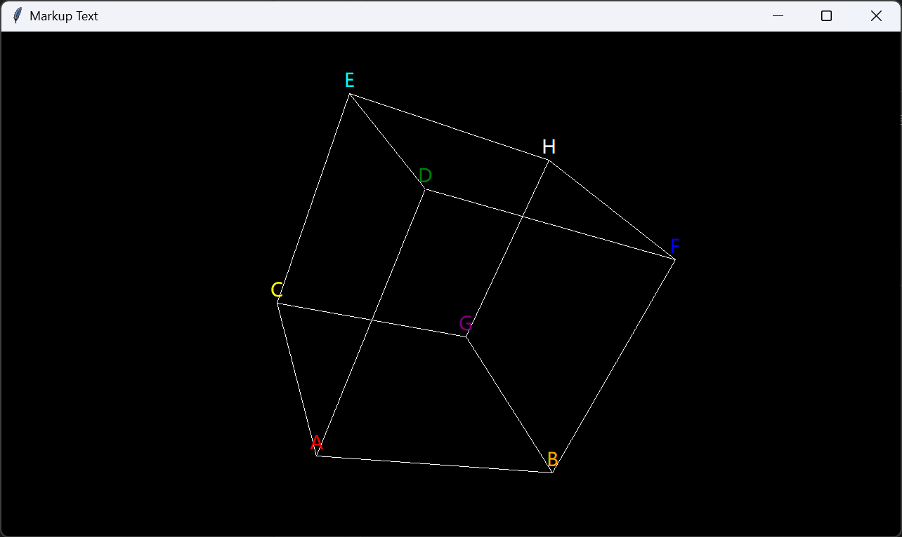
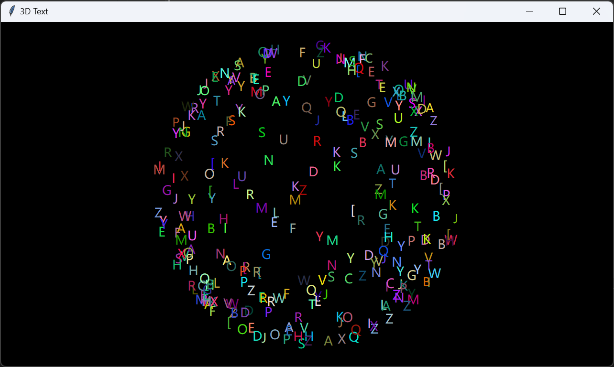

3D 文本
=======

- [3D 文本](#3d-文本)
  - [一、标记文本](#一标记文本)
  - [二、3D 文本](#二3d-文本)

一、标记文本
-----------

标记文本并不算是真正的 3D 的文本，它只是在画布上某一位置进行标记，其大小并不会随着标记点位置的改变而改变。

标记文本，顾名思义，只是为了标记而已。实际上，上一章开头的那张图中的文本就是标记文本。

标记文本是类 `tools_3d.Point` 的一个参数，下面会进行简单的演示：



上图就是很简单地给一个正方体的 8 个顶点标记了字母。看到这里，或许你可以思考一下，如何实现上一章开头的那张图的效果。

<details><summary><b>源代码</b></summary>

```python
import tkintertools as tkt
from tkintertools import tools_3d as t3d

root = tkt.Tk('Markup Text', 1280, 720)
space = t3d.Space(root, 1280, 720, 0, 0, bg='black', keep=False)

t3d.Cuboid(space, -100, -100, -100, 200, 200, 200,
           color_outline_back='white', color_outline_down='white', color_outline_front='white',
           color_outline_left='white', color_outline_right='white', color_outline_up='white')

t3d.Point(space, (-100, -100, -100), size=0, markuptext='A', markupfill='red', markupdelta=(0, 20))
t3d.Point(space, (100, -100, -100), size=0, markuptext='B', markupfill='orange', markupdelta=(0, 20))
t3d.Point(space, (-100, 100, -100), size=0, markuptext='C', markupfill='yellow', markupdelta=(0, 20))
t3d.Point(space, (-100, -100, 100), size=0, markuptext='D', markupfill='green', markupdelta=(0, 20))
t3d.Point(space, (-100, 100, 100), size=0, markuptext='E', markupfill='cyan', markupdelta=(0, 20))
t3d.Point(space, (100, -100, 100), size=0, markuptext='F', markupfill='blue', markupdelta=(0, 20))
t3d.Point(space, (100, 100, -100), size=0, markuptext='G', markupfill='purple', markupdelta=(0, 20))
t3d.Point(space, (100, 100, 100), size=0, markuptext='H', markupfill='white', markupdelta=(0, 20))

space.space_sort()
root.mainloop()
```

</details>

二、3D 文本
-----------

在 `tools_3d` 中，真正的 3D 文本实际指的是 `tools_3d.Text` 对象。它不同于标记文本，它的字体大小会随着空间位置的变化而变化。

下面是一个简单的示例：



上面的图是一个由 3D 文本组成的球，每个文本的字体大小是一样的，但由于空间上的前后关系，在后面的文本会小一些。

<details><summary><b>源代码</b></summary>

```python
import math
import random

import tkintertools as tkt
from tkintertools import tools_3d as t3d

root = tkt.Tk('3D Text', 1280, 720)
space = t3d.Space(root, 1280, 720, 0, 0, bg='black', keep=False)

r = 300  # 3D 文本球半径

for _ in range(300):
    x = random.randint(-r, r)
    y = random.randint(-r, r)
    z = random.randint(-r, r)
    if k := math.hypot(x, y, z) / r:  # 防止除数为零
        x /= k
        y /= k
        z /= k
        t = chr(random.randint(65, 91))
        c = f'#{random.randint(1, 256 ** 3 - 1):06X}'
        t3d.Text(space, map(round, (x, y, z)), text=t, fill=c)

space.space_sort()
root.mainloop()
```

</details>

---
[Last Section - 上一节](7-1.md) | [Content - 目录](README.md) | [Next Section - 下一节](7-3.md)