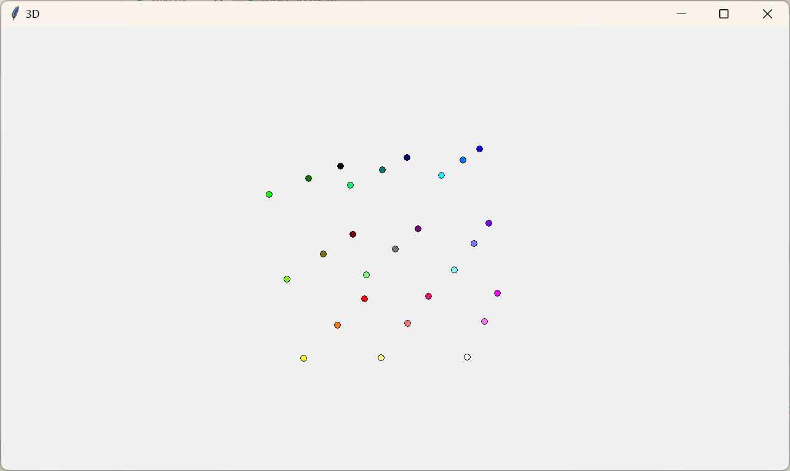
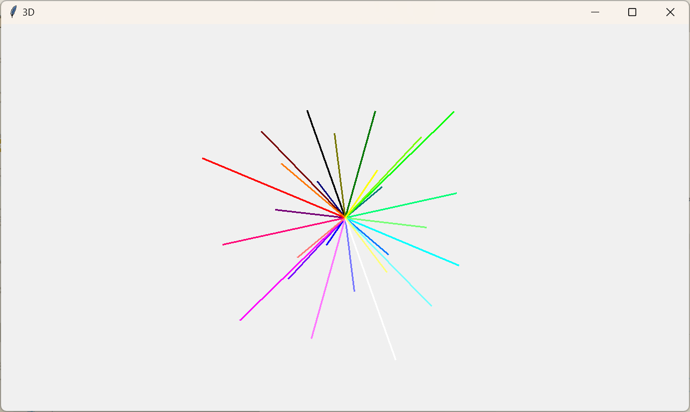
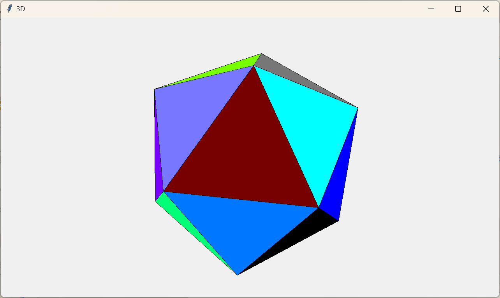
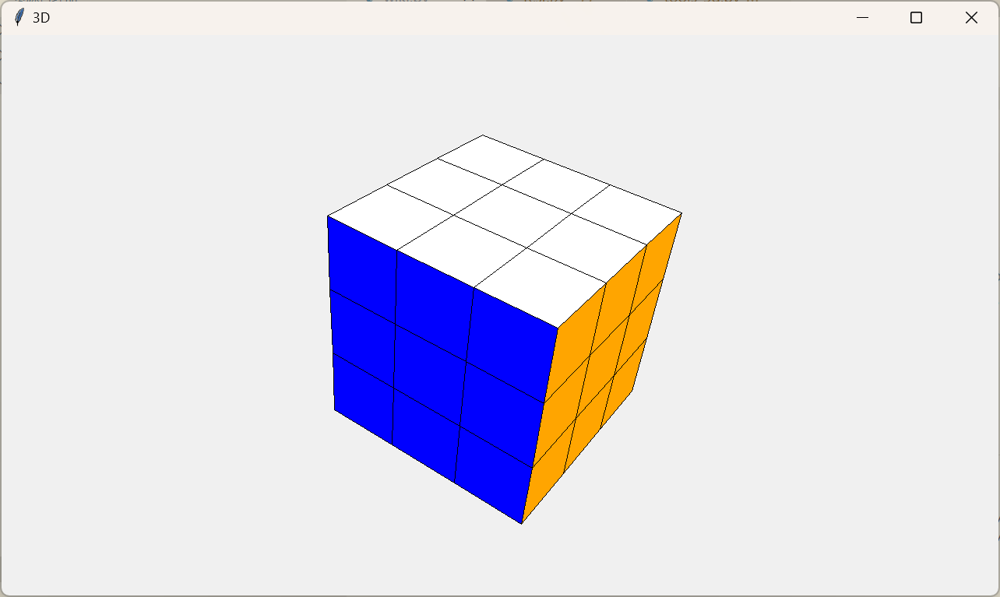
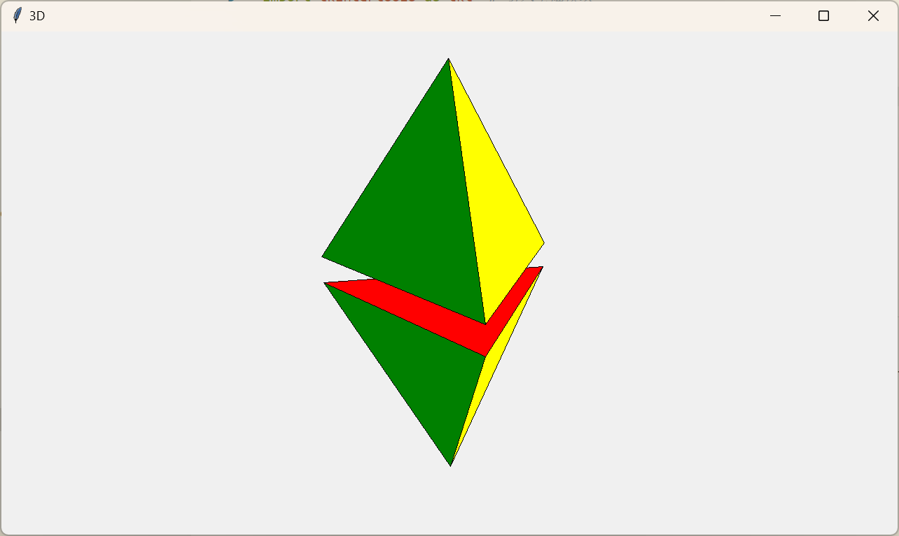
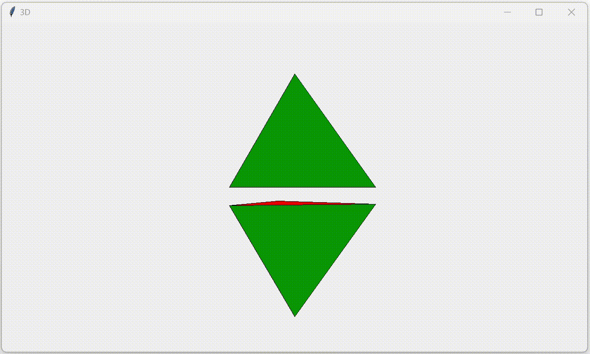

**目录**

- [创建基本的 3D 对象](#创建基本的-3d-对象)
    - [点](#点)
    - [线](#线)
    - [面](#面)
- [创建复杂的 3D 对象](#创建复杂的-3d-对象)
    - [长方体](#长方体)
    - [四面体](#四面体)
    - [任意凸面几何体](#任意凸面几何体)
- [自定义 3D 画布](#自定义-3d-画布)
    - [内置的 `Space` 类](#内置的-space-类)
    - [底层父类 `Canvas_3D`](#底层父类-canvas_3d)
    - [绑定事件](#绑定事件)
    - [简单的 3D 动画](#简单的-3d-动画)

---

## 创建基本的 3D 对象

基本的 3D 对象包括点（`Point`）、线（`Line`）和面（`Side`），除此之外，还有可以用于数学计算的基类 `_Point`、`_Line` 和 `_Side`，这些基类是无法显示出来的，也不需要承载容器，只能用于数学计算。

这些对象的载体一共有两种，分别是 `Canvas_3D` 和 `Space`，它们的区别在于，`Space` 已经内置好了平移、旋转和缩放等基本功能的调用，使用者调用 3D 对象后不需要做任何的配置和设定，直接就可以通过鼠标的拖动来完成对 3D 对象的平移、旋转和缩放，一般用于观察某些特定的 3D 对象。而 `Canvas_3D` 没有做任何的配置，用户可以自定义它的绑定事件和功能。实际上，`Canvas_3D` 就是 `Space` 的父类。

下面的展示我们都将采用 `Space` 作为载体来完成。

> **Note**  
> `Canvas_3D` 与 `Space` 和原来的 `Canvas` 控件在位置布局上不太一样！它们的 (0, 0) 坐标在画布中央！

### 点

我们通过类 `Point` 来显示一个点，具体的参数可以去 [文档](./3D%20绘图子模块) 中查看。

<details><summary><b>点击查看效果及源代码</b></summary>

**效果图**



**源代码**

```python
import tkintertools as tkt  # 引入基础模块
from tkintertools import tools_3d as t3d  # 引入 3d 子模块

root = tkt.Tk('3D', 1280, 720)  # 创建窗口
space = t3d.Space(root, 1280, 720, 0, 0)  # 创建空间

for x, r in zip([-100, 0, 100], ['00', '77', 'FF']):
    for y, g in zip([-100, 0, 100], ['00', '77', 'FF']):
        for z, b in zip([-100, 0, 100], ['00', '77', 'FF']):
            t3d.Point(space, [x, y, z], fill='#'+r+g+b, size=5)  # 创建点

space.space_sort()  # 给它们的空间位置排序以正确显示
root.mainloop()  # 消息事件循环
```

</details>

### 线

我们通过类 `Line` 来显示一条有限长直（折）线，具体参数参考 [文档](./3D%20绘图子模块)。

<details><summary><b>点击查看效果及源代码</b></summary>

**效果图**



**源代码**

```python
import tkintertools as tkt  # 引入基础模块
from tkintertools import tools_3d as t3d  # 引入 3d 子模块

root = tkt.Tk('3D', 1280, 720)  # 创建窗口
space = t3d.Space(root, 1280, 720, 0, 0)  # 创建空间

for x, r in zip([-100, 0, 100], ['00', '77', 'FF']):
    for y, g in zip([-100, 0, 100], ['00', '77', 'FF']):
        for z, b in zip([-100, 0, 100], ['00', '77', 'FF']):
            t3d.Line(space, [0]*3, [x, y, z], fill='#'+r+g+b, width=3)  # 创建线

space.space_sort()  # 给它们的空间位置排序以正确显示
root.mainloop()  # 消息事件循环
```

</details>

### 面

我们通过类 `Side` 来显示一个有限面积直边平面，具体参数参考 [文档](./3D%20绘图子模块)。

<details><summary><b>点击查看效果及源代码</b></summary>

**效果图**



**源代码**

```python
import itertools  # 组合数支持
import math  # 数学支持
import statistics  # 计算平均数

import tkintertools as tkt  # 引入基础模块
from tkintertools import tools_3d as t3d  # 引入 3d 子模块

root = tkt.Tk('3D', 1280, 720)  # 创建窗口
space = t3d.Space(root, 1280, 720, 0, 0)  # 创建空间

m = 200*math.sqrt(50-10*math.sqrt(5))/10
n = 200*math.sqrt(50+10*math.sqrt(5))/10
points = []  # 顶点列表
dis_side = 200 * (3*math.sqrt(3)+math.sqrt(15))/12 / \
    ((math.sqrt(10+2*math.sqrt(5)))/4)  # 面到中心的距离
count, color_lst = 0, ['00', '77', 'FF']  # 颜色可能值
color = ['#%s%s%s' % (r, g, b)  # 颜色列表
         for r in color_lst for g in color_lst for b in color_lst]

for i in m, -m:
    for j in n, -n:
        points.append([0, j, i])
        points.append([i, 0, j])
        points.append([j, i, 0])

for p in itertools.combinations(points, 3):  # 所有的顶点组合
    dis = math.hypot(*[statistics.mean(c[i] for c in p) for i in range(3)])
    if math.isclose(dis, dis_side):
        t3d.Side(space, *p, fill=color[count])  # 创建面
        count += 1

space.space_sort()  # 给它们的空间位置排序以正确显示
root.mainloop()  # 消息事件循环
```

</details>

## 创建复杂的 3D 对象

复杂的 3D 对象是指非基本的对象，如长方体（`Cuboid`）、四面体（`Tetrahedron`）等复杂的几何体，当然，你也可以直接用基本的 3D 对象将它们模仿出来，但这并不是封装好的，它们并非一个整体，直接使用 `Geometry` 及其子类是更加推荐的选择。

### 长方体

我们可以直接使用 `Cuboid` 来创建一个长方体，具体参数见 [文档](./3D%20绘图子模块)。

<details><summary><b>点击查看效果及源代码</b></summary>

**效果图**



**源代码**

```python
import tkintertools as tkt  # 引入基础模块
from tkintertools import tools_3d as t3d  # 引入 3d 子模块

root = tkt.Tk('3D', 1280, 720)  # 创建窗口
space = t3d.Space(root, 1280, 720, 0, 0)  # 创建空间

for a in -100, 0, 100:
    for b in -100, 0, 100:
        for c in -100, 0, 100:
            t3d.Cuboid(space, a-50, b-50, c-50, 100, 100, 100,  # 创建长（正）方体
                       color_up='white', color_down='yellow', color_left='red',
                       color_right='orange', color_front='blue', color_back='green')

space.space_sort()  # 给它们的空间位置排序以正确显示
root.mainloop()  # 消息事件循环
```

</details>

### 四面体

同上，我们也可以用 `Tetrahedron` 直接创建四面体，具体参数见 [文档](./3D%20绘图子模块)。

<details><summary><b>点击查看效果及源代码</b></summary>

**效果图**



**源代码**

```python
import math  # 数学支持

import tkintertools as tkt  # 引入基础模块
from tkintertools import tools_3d as t3d  # 引入 3d 子模块

root = tkt.Tk('3D', 1280, 720)  # 创建窗口
space = t3d.Space(root, 1280, 720, 0, 0)  # 创建空间

# 创建两个（正）四面体
t3d.Tetrahedron(space, [-100, 0, 0+10], [50, 50*math.sqrt(3), 0+10],
                [50, -50*math.sqrt(3), 0+10], [0, 0, 100*math.sqrt(2)+10],
                colors=['red', 'yellow', 'blue', 'green'])
t3d.Tetrahedron(space, [-100, 0, 0-10], [50, 50*math.sqrt(3), 0-10],
                [50, -50*math.sqrt(3), 0-10], [0, 0, -100*math.sqrt(2)-10],
                colors=['red', 'yellow', 'blue', 'green'])

space.space_sort()  # 给它们的空间位置排序以正确显示
root.mainloop()  # 消息事件循环
```

</details>

### 任意凸面几何体

除了上面提到的两种，实际我们可以通过 `Geometry` 创建任意的（凸面）多面体。但这里要注意的是，凹面几何体也是可以创建的，不过在调用它的某些 API 时可能会造成显示错误（如 `scale` 方法），因此需慎用凹面几何体。具体参数见 [文档](./3D%20绘图子模块)。

本质上，`Geometry` 的背后都是 `Side`，它只不过是将其进行了一个组合和封装，因此我们就是通过多个 `Side` 类创建它的，此外，我们在创建了它之后，还可以用它的 `append` 方法向其继续添加 `Side`。

## 自定义 3D 画布

tkintertools 的 3D 画布不是只有一个，它实际的继承关系是下面这样的：

`tk.Canvas` -> `tkt.Canvas` -> `t3d.Canvas_3D` -> `t3d.Space`

### 内置的 `Space` 类

内置的 `Space` 类已经帮我们绑定好了相关的操作方法，如平移（`translate`）、旋转（`rotate`）和缩放（`scale`）等，一般用于查看 3D 对象的外观。

但这里要说明的一点是，由于 `tkinter` 的事件绑定是一个代码覆盖的过程，也就是说，原来对同一事件绑定的代码将失效，故 `Space` 类中暂时无法使用其他的 `tkintertools` 控件，因为其部分功能会失效。

### 底层父类 `Canvas_3D`

`Canvas_3D` 属于是什么都没有绑定的一个容器控件了。它存在的目的就是让使用者可以自定义绑定的事件及绑定的函数，而不是强制使用某些按键来触发某些事件（如鼠标左键拖动旋转 3D 对象）。这里也要说明一点的就是，由于 `Canvas_3D` 没有绑定任何额外的事件，因此 `tkintertools` 的控件在上面是可以完全正常使用的。

### 绑定事件

每个 3D 对象都有三个基本的功能，分别为平移（`translate`）、旋转（`rotate`）和缩放（`scale`），使用者可以根据自身需要，自定义绑定事件并调用相关的方法。比如说，我们现在想做这样一个绑定：按下等号键和减号键可以使每个 3D 对象自身的大小进行缩放，那么就可以按下面的步骤做。

分析：使 3D 对象自身大小进行缩放需要调用方法 `scale`，且缩放中心就是每个 3D 对象自身的几何中心，查阅 [文档]((./3D%20绘图子模块)) 得知，参数 `center` 值为 `None`，也就是默认值的时候，它会按自身的几何中心进行缩放。这里可以使用 `Canvas_3D` 作为容器控件，也可以使用 `Space`，这并不会影响到这个功能的实现。

<details><summary><b>点击查看效果及源代码</b></summary>

**效果图**


**源代码**

```python
import tkintertools as tkt  # 引入基础模块
from tkintertools import tools_3d as t3d  # 引入 3d 子模块

root = tkt.Tk('3D', 1280, 720)  # 创建窗口
space = t3d.Space(root, 1280, 720, 0, 0)  # 创建空间

for a in -100, 0, 100:
    for b in -100, 0, 100:
        for c in -100, 0, 100:
            t3d.Cuboid(space, a-50, b-50, c-50, 100, 100, 100,  # 创建正方体
                       color_up='white', color_down='yellow', color_left='red',
                       color_right='orange', color_front='blue', color_back='green')
space.space_sort()  # 空间位置排序，以正确显示


def scale(event):
    """ 缩放事件 """
    k = 1.05 if event.keysym == 'equal' else 0.95 if event.keysym == 'minus' else 1  # 缩放比率
    for geo in space.geos():  # 遍历所有的几何体（不包括基本 3D 对象）
        geo.scale(k, k, k)  # 缩放
        geo.update()  # 更新改对象的实际画面
    space.space_sort()  # 空间前后位置排序


root.bind('<Key-equal>', scale)  # 绑定等号按键
root.bind('<Key-minus>', scale)  # 绑定减号按键
root.mainloop()  # 消息事件循环
```

</details>

### 简单的 3D 动画

动画嘛，很简单，原理和上面的类似，只不过将手动改变状态改成了自动改变状态，如让它自动旋转。下面给一个简单的示例。

<details><summary><b>点击查看效果及源代码</b></summary>

**效果图**



**源代码**

```python
import math  # 数学支持

import tkintertools as tkt  # 引入基础模块
from tkintertools import tools_3d as t3d  # 引入 3d 子模块

root = tkt.Tk('3D', 1280, 720)  # 创建窗口
space = t3d.Space(root, 1280, 720, 0, 0)  # 创建空间

# 创建两个（正）四面体
t1 = t3d.Tetrahedron(
    space, [-100, 0, 0+10], [50, 50*math.sqrt(3), 0+10],
    [50, -50*math.sqrt(3), 0+10], [0, 0, 100*math.sqrt(2)+10],
    colors=['red', 'yellow', 'blue', 'green'])
t2 = t3d.Tetrahedron(
    space, [-100, 0, 0-10], [50, 50*math.sqrt(3), 0-10],
    [50, -50*math.sqrt(3), 0-10], [0, 0, -100*math.sqrt(2)-10],
    colors=['red', 'yellow', 'blue', 'green'])


def spin():
    """ 自动旋转 """
    t1.rotate(dz=0.01)
    t2.rotate(dz=0.01)


def floating(value):
    """ 上下浮动 """
    t1.translate(dz=math.sin(value))
    t2.translate(dz=math.sin(value))


def animation(value=0):
    """ 形成动画 """
    spin()
    floating(value)
    space.space_sort()  # 给它们的空间位置排序以正确显示
    t1.update()
    t2.update()
    space.after(10, animation, value+math.pi/60)


animation()
root.mainloop()  # 消息事件循环
```

</details>

---

如果你看到了这里，想必你已经明白如何创建一个 3D 对象了，那不妨试试把下面的这个 3D 对象（苯环）画出来？

<details><summary><b>点击查看效果及源代码</b></summary>

**效果图**


**源代码**

```python
import math  # 数学支持

import tkintertools as tkt  # 引入基础模块
from tkintertools import tools_3d as t3d  # 引入 3d 子模块

root = tkt.Tk('3D', 1280, 720)  # 创建窗口
space = t3d.Space(root, 1280, 720, 0, 0)  # 创建空间
last_point = [0, 100*math.cos(-math.pi/3), 100*math.sin(-math.pi/3)]
color_lst = ['red', 'orange', 'yellow', 'green', 'blue', 'purple']
color_lst += color_lst

for i in range(6):
    rad = i*math.pi/3
    next_point = [0, 100*math.cos(rad), 100*math.sin(rad)]
    point_h2 = [0, 150*math.cos(rad), 150*math.sin(rad)]
    t3d.Line(space, last_point, next_point, width=3, fill=color_lst[i])
    t3d.Line(space, next_point, point_h2, width=3, fill=color_lst[i+1])
    t3d.Point(space, last_point, size=20, fill=color_lst[i+2])
    t3d.Point(space, point_h2, size=10, fill=color_lst[i+3])
    last_point = next_point

space.space_sort()  # 给它们的空间位置排序以正确显示
root.mainloop()  # 消息事件循环
```

</details>
