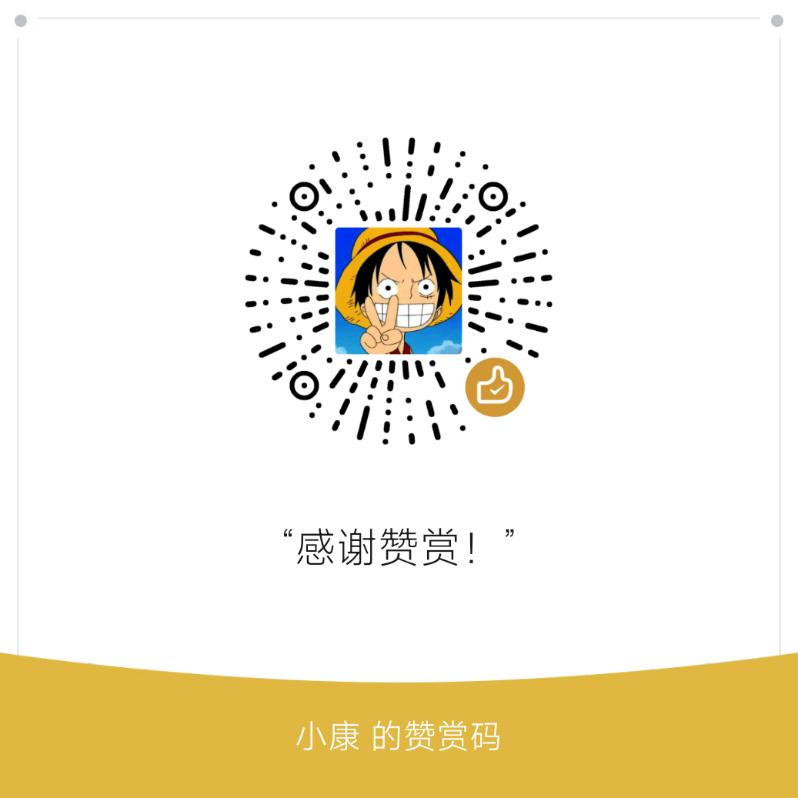

First of all, thank you for your idea of supporting this project! ❤️  
首先，感谢您有想支持本项目的想法！❤️

!!! tip "Tip / 提示"

    If you like the project but don't have the means to give financial support, that's okay too. There are other easy ways to support the project and show your gratitude, and we are also very happy, such as star the project! ⭐  
    如果你喜欢这个项目，但是没有办法给出金钱上的支持，那也没关系。还有其他简单的方法可以支持该项目并表达您的感激之情，我们也非常高兴，例如给这个项目加星标！⭐

Here are all the ways to sponsor:  
以下是所有的赞助方式：

=== "🟢 WeChat Appreciation Code / 微信赞赏码"

    <p align="center">
    
    </p>

=== "🟣 afdian / 爱发电"

    <p align="center">
    
    </p>

=== "🔵 Others / 其它方式"

    !!! failure

        We're sorry, but other sponsorship methods are not supported at this time  
        非常抱歉，其它赞助方式暂时不支持

Please include some information when sponsoring, in the following format:  
请在赞助时注明一些信息，格式如下：

```linenums="0"
tkt [your nickname or your GitHub Username]
```

or  
或者

```linenums="0"
tkt [你的昵称或者你的 GitHub 用户名]
```

I'll put `[your nickname]` and the time and amount of your sponsorship below! Of course, you can also be anonymous.  
我会将 `[你的昵称]` 和你赞助的时间与金额放在下面！当然，你也可以匿名。

This page will be updated on an ongoing basis to list as many people as possible who have given monetary sponsorship!  
本页面将持续更新，以尽可能列出所有给出金钱赞助的人！

This page is not updated automatically, but manually by me, so please understand that the sponsored list may not be updated in time.  
此页面并非自动更新，而是由我手动更新的，因此赞助列表可能更新不及时，请谅解。

| 🕓 Date / 日期 { data-sort-method=min } |       😀 Sponsors / 赞助者       | 💰 Amount / 金额 { data-sort-method=number } | ❤️ Methods / 方式 |
| :------------------------------------: | :-----------------------------: | :-----------------------------------------: | :--------------: |
|          2024-08-14 10:19:15           |  https://github.com/shu-shu-1   | ¥60.00 :crown:{ title="Sponsor the Most" }  |    微信赞赏码    |
|          2024-08-14 10:19:56           |             junfeng             |                    ¥5.00                    |    微信赞赏码    |
|          2024-08-14 09:41:03           |            ssrr2329             |                   ¥50.00                    |    微信赞赏码    |
|          2024-08-13 19:03:52           |  https://github.com/shu-shu-1   |                   ¥21.00                    |    微信赞赏码    |
|          2024-07-11 23:01:34           |              Lau9               |                    ¥9.99                    |    微信赞赏码    |
|          2024-07-11 23:00:50           |           curios-city           |                    ¥8.88                    |    微信赞赏码    |
|          2024-07-11 22:59:39           |            ShenNong             |                    ¥7.77                    |    微信赞赏码    |
|          2024-06-23 01:30:14           |                                 |                    ¥6.66                    |    微信赞赏码    |
|          2024-06-03 21:48:05           | https://github.com/TotoWang-hhh |                    ¥1.00                    |    微信赞赏码    |
